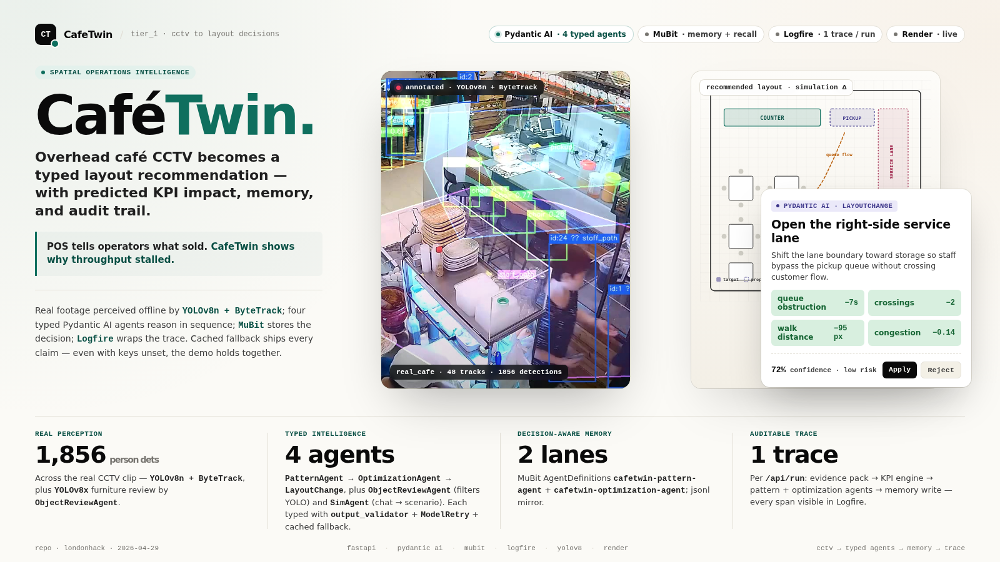
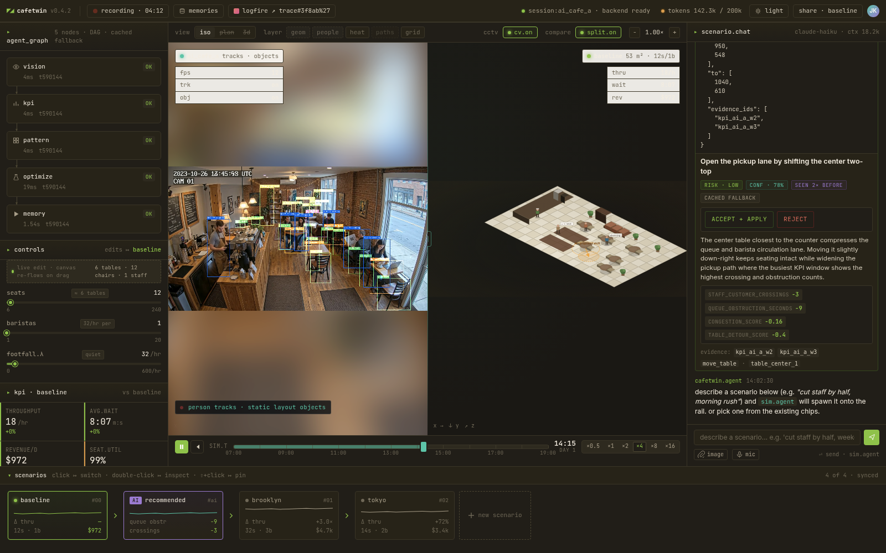
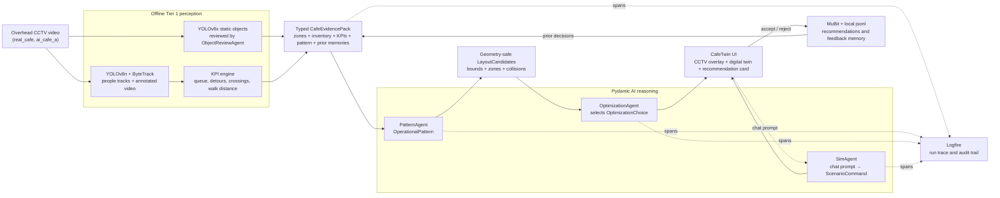

# CafeTwin



CafeTwin watches overhead cafe CCTV, spots what's slowing throughput — queues blocking the barista path, staff weaving around tables, crowded pickup lanes — and recommends a single layout change to fix it, backed by the camera evidence and a "seen before" chip if the issue has recurred. The interface shows the live annotated CCTV next to a digital twin of the cafe, so operators see the same thing the AI does.

Under the hood: real perception (YOLOv8 + ByteTrack, deterministic KPI engine) feeds four Pydantic AI agents whose outputs are typed, validated, geometry-checked, and persisted to MuBit memory; one Logfire trace covers every run.

Built at the **Unicorn Mafia London-to-SF "To the Americas" hackathon** — **4th place out of 47 submissions** and winner of the **Render bounty**. Full project list: <https://london-to-sf.unicornmafia.ai/projects/>.

**Live demo:** <https://frontend-tier1.vercel.app/cafetwin.html>



*Live UI — annotated CCTV with YOLOv8 + ByteTrack overlays on the left, iso digital twin on the right*

**Built by** [Alex](https://github.com/alexzh3) · [Samuel](https://github.com/Samy-a-dev) · [David](https://github.com/davidscode404)

## What CafeTwin currently ships

Two demo sessions (`ai_cafe_a` and `real_cafe`) run end-to-end with **real perception** on every stage:

- **Perception → KPIs.** YOLOv8 + ByteTrack people tracks, YOLOv8x static objects filtered by `ObjectReviewAgent`, and a deterministic KPI engine for crossings, queue obstruction, table detour, and walk distance.
- **Four Pydantic AI agents.** `ObjectReviewAgent`, `PatternAgent`, `OptimizationAgent`, `SimAgent` — all typed end-to-end with `output_validator` + `ModelRetry` and cached fallbacks. `PatternAgent` + `OptimizationAgent` are also versioned MuBit AgentDefinitions.
- **Two recommendation surfaces.** `OptimizationAgent` proposes spatial shifts (move table / chair / station / queue-boundary). `SimAgent` turns plain-English what-ifs ("cut staff by half", "handle a 200/hr rush", "Brooklyn vibe") into structured scenarios over seats / baristas / footfall / hours / style.
- **Decision-aware memory.** MuBit + local jsonl mirror; the optimizer recalls prior accept/reject decisions on the same pattern so it favors what worked and skips rejected repeats. UI surfaces a "seen N× before" chip.
- **Streamed runs + full observability.** `POST /api/run/stream` emits SSE stage events to the split-view UI (annotated CCTV ↔ iso twin); one Logfire trace per `/api/run` covers every stage and agent call.

## CafeTwin architecture



*Real CCTV is processed offline into typed evidence. Deterministic geometry
checks generate safe moves, Pydantic AI chooses and explains one, and
MuBit/jsonl memory plus Logfire make the result repeatable and auditable.*

For architecture detail see [`docs/overview_plan.md`](docs/overview_plan.md) (high level) and [`docs/agent_plan.md`](docs/agent_plan.md) (engineering). Current build state is summarised in `docs/overview_plan.md` § Implementation Status.

## Quick start (local)

```bash
git clone <this-repo>
cd <this-repo>

cp .env.example .env       # then edit .env (see "Environment" below)

./scripts/setup.sh         # uv venv + uv sync + .env sanity check
./scripts/test.sh          # pytest + ruff
./scripts/dev.sh           # backend on :8000 + frontend on :5500
```

Open <http://127.0.0.1:5500/cafetwin.html>. The page calls `/api/state`
then `/api/run/stream` on mount; the agent flow lights up from real
backend stages as they stream in, the recommendation card renders the
live `LayoutChange`, and the Logfire button opens the trace for that
run. The CCTV pane auto-engages on the left as long as the session has
an annotated video artifact — both shipped sessions do.

Default session is `ai_cafe_a`. Switch to the real-CCTV session with:

```
http://127.0.0.1:5500/cafetwin.html?session=real_cafe
```

The cached perception artifacts ship under `demo_data/sessions/`. To regenerate them from scratch (YOLO tracks, static-object detections, review pass, web-friendly transcode), see [`scripts/README.md`](scripts/README.md).

## Prerequisites

- Python 3.10+ (3.12 runs on Render; 3.13 pinned locally via `.python-version`).
- [`uv`](https://docs.astral.sh/uv/getting-started/installation/) for venv + dependency management.
- For the live agent path:
  - A Pydantic AI Gateway API key (`PYDANTIC_AI_GATEWAY_API_KEY`) **or** a direct `ANTHROPIC_API_KEY`.
  - A Logfire write token (`LOGFIRE_TOKEN`) + project URL (`LOGFIRE_PROJECT_URL`) for trace links.
- For the perception rebuild path only: `ffmpeg` on PATH (used by `scripts/vision/transcode_annotated_for_web.sh`).

The cached fallback runs fully offline on the committed fixture packs
and needs none of the above — useful as a demo safety net, not as the
main path.

## Environment

`.env.example` is the template. Real values go in `.env` (gitignored).

| Var | Purpose |
|---|---|
| `PYDANTIC_AI_GATEWAY_API_KEY` | Live agents via Pydantic AI Gateway (preferred). |
| `ANTHROPIC_API_KEY` | Direct Anthropic fallback if Gateway key is absent. |
| `CAFETWIN_OPTIMIZATION_MODEL` | e.g. `gateway/anthropic:claude-sonnet-4-6` (default) or `anthropic:claude-sonnet-4-5`. |
| `CAFETWIN_OBJECT_REVIEW_MODEL` | Model for `ObjectReviewAgent` (same format). |
| `CAFETWIN_SIM_MODEL` | Model for `SimAgent` (same format). |
| `CAFETWIN_FORCE_FALLBACK=1` | Skip every live agent; always return cached outputs. Demo safety net. |
| `LOGFIRE_TOKEN` + `LOGFIRE_PROJECT_URL` | Real Logfire spans + clickable trace URL on the top bar. |
| `LOGFIRE_SERVICE_NAME` / `LOGFIRE_ENVIRONMENT` | Optional span tags for filtering (e.g. `cafetwin-backend-tier1` / `demo`). |
| `MUBIT_API_KEY` | Enables MuBit primary memory writes/recall + Agent Cards; jsonl remains the always-on fallback. |
| `CAFETWIN_MUBIT_AGENTS=1` | Route per-lane memory writes through per-agent MuBit AgentDefinitions (Tier 1E). |
| `CAFETWIN_RENDER_URL` | Set after Render deploy; consumed by `scripts/deploy_vercel.sh`. |
| `RENDER_DEPLOY_HOOK` | Optional; lets `scripts/deploy_render.sh` trigger redeploys without the dashboard. |

## Demo modes

The page works in three honest modes depending on which keys are populated:

| Mode | What's live | When to use |
|---|---|---|
| **Full** (all keys set) | Real perception + live agents + clickable Logfire trace per `/api/run` + MuBit memory. | Pitch demo. |
| **Live agents, no Logfire** (`*_API_KEY` set, `LOGFIRE_TOKEN` empty) | Full pipeline + real Pydantic AI calls. Top-bar Logfire button greyed. | Local dev when you have an LLM key but don't want to send traces. |
| **Cached fallback** (`CAFETWIN_FORCE_FALLBACK=1`) | Stages, KPIs, `LayoutChange`, memory writes — all real, but the LLM is not called. | Offline demos and safety net. Works with zero external services. |

Reload after **Accept** in any mode to see the "seen N× before" chip —
that's the real memory-recall path against MuBit when configured, with
`demo_data/mubit_fallback.jsonl` as the always-on mirror/fallback.

## API routes

Eight routes covering state, reasoning, streaming, chat, feedback, and
memory. Full details + Logfire span tree in `agent_plan.md §FastAPI
routes`.

```
GET  /api/sessions                         → list of SessionManifest
GET  /api/state?session_id=...             → fixtures + live KPIs + zones + inventory + pattern
POST /api/run        { session_id }        → 4 stages + LayoutChange + MemoryRecord + logfire_trace_url
POST /api/run/stream { session_id }        → SSE stream of the same pipeline
POST /api/sim/prompt { scenario, prompt }  → typed ScenarioCommand (SimAgent)
POST /api/feedback   { ... decision }      → MemoryRecord
GET  /api/memories?session_id=...          → merged MuBit + jsonl, scoped to session
GET  /api/logfire_url                      → cached trace URL for top-bar
```

## Deploy

The recommended split is **Vercel for the static frontend + Render for
the FastAPI backend**. Vercel rewrites `/api/*` plus backend-served
media paths (`/demo_data/*`, `/cafe_videos/*`) to the Render origin so
the deployed frontend stays same-origin (no CORS preflight, no
hardcoded API/video URL in `cafetwin.html`).

Hosted demo:

| Surface | URL |
|---|---|
| Frontend (Vercel project `frontend-tier1`) | <https://frontend-tier1.vercel.app/cafetwin.html> |
| Backend (Render service `cafetwin-backend-tier1`) | <https://cafetwin-backend-tier1.onrender.com> |

### 1. Backend on Render

`render.yaml` at the repo root declares the `cafetwin-backend-tier1` web
service.

```bash
git push                          # Render auto-deploys when connected.
./scripts/deploy_render.sh        # one-time walkthrough; prints next steps.
```

First-time:

1. Push the repo (with `render.yaml`) to GitHub.
2. <https://dashboard.render.com> → **New** → **Blueprint** → connect repo.
3. In the service Environment tab, set the secrets listed in `render.yaml` (`LOGFIRE_TOKEN`, `LOGFIRE_PROJECT_URL`, `ANTHROPIC_API_KEY` / `PYDANTIC_AI_GATEWAY_API_KEY`, `MUBIT_API_KEY`, …). `render.yaml` defaults `CAFETWIN_FORCE_FALLBACK="1"` as a safety net — clear it from the dashboard once those secrets are in place to run the live agents in production.
4. After Render assigns a public URL, set it in your local `.env`:
   ```bash
   CAFETWIN_RENDER_URL=https://cafetwin-backend-tier1.onrender.com
   ```
5. Smoke-test:
   ```bash
   ./scripts/deploy_render.sh --smoke
   ```

Optional: copy the deploy hook from **Render → cafetwin-backend-tier1 →
Settings → Deploy Hook** into `.env` as `RENDER_DEPLOY_HOOK=...` so
subsequent runs of `./scripts/deploy_render.sh` trigger a redeploy
without the dashboard.

### 2. Frontend on Vercel

```bash
./scripts/deploy_vercel.sh
```

This generates `frontend/vercel.json` with a `/api/*` rewrite pointing
at `CAFETWIN_RENDER_URL`, then runs `vercel deploy --prod` from the
`frontend/` directory. Prereqs: a Vercel account, `vercel login` once.
The script falls back to `npx vercel@latest` if the CLI is not
installed globally. For a secret-minimal deploy, pass the backend URL
inline so the script does not need to read `.env`:

```bash
CAFETWIN_RENDER_URL=https://cafetwin-backend-tier1.onrender.com ./scripts/deploy_vercel.sh
```

## Project layout

```
app/                  FastAPI backend (routes, agents, memory, logfire setup)
  schemas.py          Strict Pydantic models — the source of truth
  agents/             Pydantic AI agents (pattern, optimization, object_review, sim)
  api/                FastAPI app + 8 API routes
  vision/             Tracks + static-object + KPI engine contracts
  layout_candidates.py  Geometry-safe shift generator + strict validators
  evidence_pack.py    Live KPI/inventory augmentation + prior-memory recall
  mubit_agents.py     MuBit AgentDefinition bootstrap (Tier 1E)
demo_data/sessions/   Per-session fixture + perception packs (ai_cafe_a, real_cafe)
cafe_videos/          Source CCTV clips
frontend/             Babel-in-browser JSX demo + api.js fetch wrappers + CCTV pane
scripts/              setup / dev / test / smoke / YOLO / transcode / deploy_*.sh
tests/                pytest suite + conftest blanking secret env
docs/                 Long-form plans (agent_plan.md, overview_plan.md), vision benchmarks, judge overview
.agents/handoff.md    Multi-agent coordination sticky note (gitignored)
render.yaml           Render Blueprint config for the backend
```
