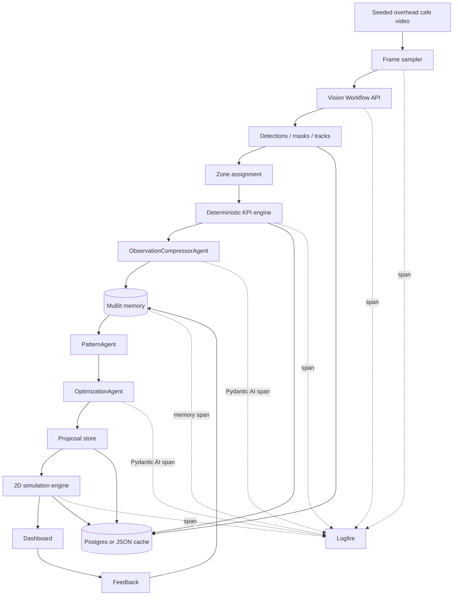
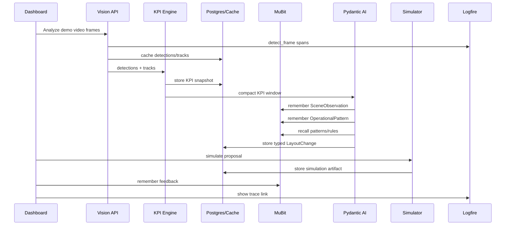
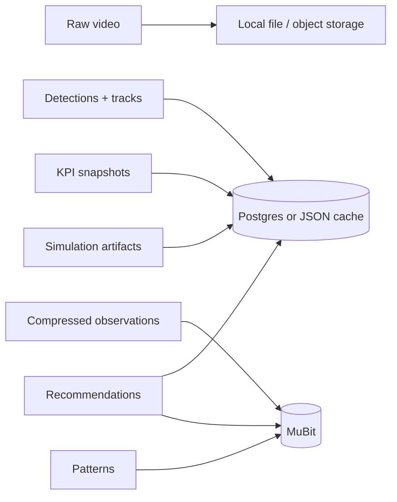
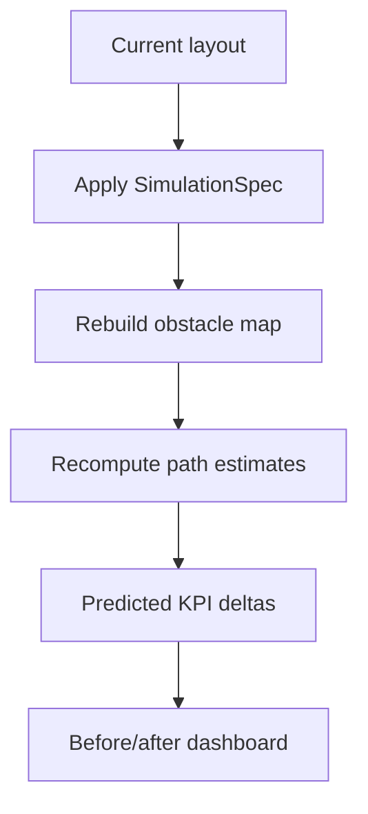
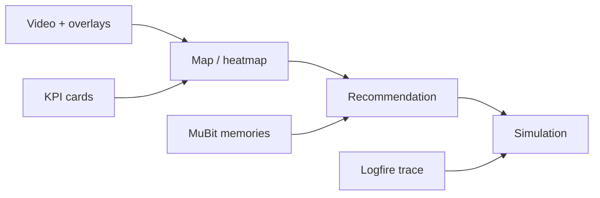

# CafeTwin Engineering Plan

## Purpose

This is the detailed implementation plan for agents/engineers. It aligns with `gpt_plan.md`, which is the overview plan. Do not fork the product direction from the overview: CafeTwin is a 24h hackathon demo for overhead-camera cafe operations optimization.

The product loop is:

```text
overhead video
-> detection / segmentation / tracking
-> zones + deterministic KPIs
-> compressed MuBit memories
-> Pydantic AI pattern + optimization agents
-> evidence-backed layout recommendation
-> 2D before/after simulation
-> feedback memory
-> Logfire trace
```

## Product Thesis

Restaurants and cafes usually optimize from POS receipts. POS tells operators what sold, not why throughput stalled. CafeTwin makes spatial friction visible: staff detours, queue crossings, pickup congestion, table blockage, and underused seating.

The demo should land this line:

> POS tells you what sold. CafeTwin shows why throughput stalled.

## System Architecture



## Runtime Sequence



## API Choices

### Default Vision Path

Use **Roboflow Workflows** as the primary hackathon path.

Reason: it can combine object detection, segmentation, tracking, zones, time-in-zone, heatmaps, and visualizations behind one hosted workflow. That is much less risky than spending the day tuning local GPU drivers.

Recommended workflow blocks:

- Object Detection Model
- Instance Segmentation Model, if available for the chosen model
- Byte Tracker / ByteTrack Tracker
- Polygon Zone Visualization
- Time in Zone
- Heatmap Visualization or Trace Visualization
- Optional: SAM 2 / SAM 3 for masks where the detector does not segment tables/chairs well

References:

- https://docs.roboflow.com/workflow-blocks/run-a-model/object-detection-model
- https://inference.roboflow.com/workflows/blocks/byte_tracker/
- https://inference.roboflow.com/workflows/video_processing/overview/
- https://docs.roboflow.com/deploy/supported-models

### Local Fallback

Use Ultralytics if Roboflow setup is blocked.

```python
from ultralytics import YOLO

model = YOLO("yolo11n.pt")
results = model.track(
    source="demo_data/cafe.mp4",
    tracker="bytetrack.yaml",
    persist=True,
)
```

If segmentation is needed:

```python
model = YOLO("yolo11n-seg.pt")
```

Reference:

- https://docs.ultralytics.com/modes/track/

### Simulation / Image Editing

MVP simulation is deterministic 2D. Optional inpainted "after" image can use:

- Replicate image inpainting model
- Roboflow Stability AI Inpainting block, if available in workflow
- Local Stable Diffusion / ControlNet only if already configured

Do not depend on video generation for judging. Generated video is stretch polish only.

## Data Ownership



- Raw frames and detections stay in Postgres/local JSON cache.
- MuBit stores compressed observations and learned patterns.
- Logfire stores traces, timings, costs, and agent spans.

## MuBit Design

### Lanes

| Lane | Writer | Reader | Contents |
|---|---|---|---|
| `location:demo:scene` | Observation compressor | Pattern agent, dashboard | 10-second scene summaries. |
| `location:demo:kpi` | KPI engine | Pattern agent, optimization agent | KPI snapshots and window summaries. |
| `location:demo:patterns` | Pattern agent | Optimization agent | Bottlenecks and evidence chains. |
| `location:demo:recommendations` | Optimization agent, feedback handler | Optimization agent | Proposal outcomes and feedback. |
| `org:rules` | Seed/admin | All agents | Hard constraints and safety rules. |

### Intents

Use these intent strings consistently:

| Intent | Use |
|---|---|
| `trace` | Raw-ish pipeline events and simulation runs. |
| `fact` | KPI snapshots. |
| `lesson` | Scene observations and operational patterns. |
| `rule` | Constraints and "never suggest this again" feedback. |
| `feedback` | Manager decisions on recommendations. |
| `tool_artifact` | Tool-call metadata and generated artifacts. |

### SDK vs MCP

Use MuBit SDK directly for deterministic pipeline writes:

- KPI engine writes `location:demo:kpi`
- Observation compressor writes `location:demo:scene`
- Pattern agent writes `location:demo:patterns`
- Feedback handler writes `location:demo:recommendations`

Use MuBit MCP only if the optimization agent benefits from tool-style recall. Keep the MCP toolset small:

- `recall`
- `get_context`
- `archive`, only for bit-exact artifacts

No wildcard lanes. Register or configure explicit lanes.

## Pydantic Models

```python
from datetime import datetime
from typing import Literal
from uuid import UUID

from pydantic import BaseModel, Field


class Detection(BaseModel):
    frame_idx: int
    timestamp_s: float
    track_id: int | None
    class_name: Literal[
        "person",
        "person_staff",
        "person_customer",
        "table",
        "chair",
        "counter",
        "pickup_area",
        "queue_area",
    ]
    bbox_xyxy: tuple[float, float, float, float]
    mask_polygon: list[tuple[float, float]] | None = None
    confidence: float


class TrackPoint(BaseModel):
    track_id: int
    timestamp_s: float
    x: float
    y: float
    zone_id: str | None = None


class Zone(BaseModel):
    id: str
    name: str
    kind: Literal["counter", "queue", "pickup", "seating", "staff_path", "entrance"]
    polygon: list[tuple[float, float]]


class KPIReport(BaseModel):
    window_start_s: float
    window_end_s: float
    staff_walk_distance_px: float
    staff_customer_crossings: int
    queue_length_peak: int
    queue_obstruction_seconds: float
    congestion_score: float
    table_detour_score: float


class EvidenceRef(BaseModel):
    memory_id: str
    lane: str
    summary: str


class SceneObservation(BaseModel):
    location_id: str
    window_start_s: float
    window_end_s: float
    kpi: KPIReport
    notable_events: list[str]
    evidence_frame_idxs: list[int]
    session_id: UUID
    run_id: UUID


class OperationalPattern(BaseModel):
    title: str
    summary: str
    pattern_type: Literal["queue_crossing", "staff_detour", "table_blockage", "pickup_congestion"]
    evidence: list[EvidenceRef]
    severity: Literal["low", "medium", "high"]
    affected_zones: list[str]


class SimulationSpec(BaseModel):
    action: Literal["move_table", "move_chair", "move_station", "change_queue_boundary"]
    target_id: str
    from_position: tuple[float, float]
    to_position: tuple[float, float]
    rotation_degrees: float = 0


class LayoutChange(BaseModel):
    title: str
    rationale: str
    target_id: str
    simulation: SimulationSpec
    evidence: list[EvidenceRef] = Field(min_length=3)
    expected_kpi_delta: dict[str, float]
    confidence: float
    risk: Literal["low", "medium", "high"]
    fingerprint: str


class StaffingAdjustment(BaseModel):
    title: str
    rationale: str
    evidence: list[EvidenceRef] = Field(min_length=3)
    expected_kpi_delta: dict[str, float]
    confidence: float
    risk: Literal["low", "medium", "high"]
    fingerprint: str


class EquipmentRepositioning(BaseModel):
    title: str
    rationale: str
    simulation: SimulationSpec
    evidence: list[EvidenceRef] = Field(min_length=3)
    expected_kpi_delta: dict[str, float]
    confidence: float
    risk: Literal["low", "medium", "high"]
    fingerprint: str


class NoActionRecommended(BaseModel):
    reason: str


OptimizationProposal = LayoutChange | StaffingAdjustment | EquipmentRepositioning | NoActionRecommended
```

## Agent Contracts

### ObservationCompressorAgent

Input:

- `KPIReport`
- selected detection/track summaries
- zone definitions

Output:

- `SceneObservation`

Rules:

- Do not invent service events that are not supported by tracks/zones.
- Name only spatial/flow events visible in the KPI window.
- Keep output compact enough for MuBit.

### PatternAgent

Input:

- recent `SceneObservation` memories
- recent `KPIReport` memories

Output:

- `OperationalPattern[]`

Rules:

- Aggregate across windows.
- Evidence must point to MuBit memory IDs.
- Prefer deterministic patterns first: crossings, detours, queue obstruction.

### OptimizationAgent

Input:

- `OperationalPattern[]`
- `org:rules`
- current layout/zones

Output:

- `OptimizationProposal`

Rules:

- Prefer one high-confidence `LayoutChange` for the demo.
- Every concrete proposal needs at least 3 evidence refs.
- Include measurable expected KPI deltas.
- Return `NoActionRecommended` if evidence is weak.

## KPI Computation

Keep KPIs deterministic and explainable.

### Staff Walking Distance

For each staff track:

```text
sum(distance(track_point_i, track_point_i+1))
```

Use pixels for MVP. Real-world meters require calibration and are out of scope.

### Path Crossings

For each staff segment and customer segment in the same time window:

```text
count(intersects(staff_segment, customer_segment))
```

Also count intersections with queue-zone polygon.

### Queue Length Proxy

For each sampled frame:

```text
count(person centers inside queue zone)
```

Peak and average over the window.

### Queue Obstruction Seconds

For each frame:

```text
queue obstructed if staff path segment intersects queue zone
or table/chair mask overlaps queue corridor above threshold
```

Sum duration across sampled frames.

### Table Detour Score

MVP approximation:

```text
actual staff path length / straight-line counter-to-seating distance
```

Higher values imply detours.

## Simulation

MVP is a 2D deterministic simulation over the floor map.

Inputs:

- zones
- table/chair positions
- selected proposal
- staff/customer track history

Steps:

1. Clone current layout.
2. Apply `SimulationSpec`.
3. Recompute obstacle map.
4. Re-estimate shortest staff paths around obstacles.
5. Recompute estimated path crossings and walking distance.
6. Render before/after side by side.



The simulation is the operational proof. Inpainted/video previews are optional visual polish.

## Dashboard

One Streamlit or lightweight React/FastAPI page.

Required panels:

- Video with overlays.
- Zone map and movement trails.
- KPI cards.
- MuBit memory timeline.
- Recommendation card.
- Before/after simulation.
- Logfire trace ID/link.

Recommended visual layout:



## Minimal Backend API

```text
POST /seed
POST /analyze
POST /compress
POST /recommend
POST /simulate/{proposal_id}
POST /feedback/{proposal_id}
GET  /api/state
GET  /health
```

`/analyze` may use cached detections by default. Include a UI toggle or env var for live Roboflow calls.

## Source-Of-Truth Schema

Use SQLite/Postgres/local JSON depending on speed. Postgres is ideal if already wired; JSON is acceptable for the hackathon.

```sql
CREATE TABLE events (
  id UUID PRIMARY KEY,
  session_id UUID NOT NULL,
  run_id UUID NOT NULL,
  kind TEXT NOT NULL,
  ts TIMESTAMPTZ NOT NULL,
  payload JSONB NOT NULL,
  mubit_memory_id TEXT
);

CREATE TABLE proposals (
  id UUID PRIMARY KEY,
  session_id UUID NOT NULL,
  fingerprint TEXT UNIQUE,
  kind TEXT NOT NULL,
  payload JSONB NOT NULL,
  evidence_ids JSONB NOT NULL,
  expected_kpi_delta JSONB,
  status TEXT NOT NULL,
  simulation_artifact_id UUID,
  created_at TIMESTAMPTZ NOT NULL
);

CREATE TABLE feedback (
  id UUID PRIMARY KEY,
  proposal_id UUID REFERENCES proposals(id),
  decision TEXT NOT NULL,
  note TEXT,
  created_at TIMESTAMPTZ NOT NULL,
  mubit_memory_id TEXT
);

CREATE TABLE simulation_artifacts (
  id UUID PRIMARY KEY,
  proposal_id UUID REFERENCES proposals(id),
  path TEXT,
  payload JSONB,
  mubit_archive_id TEXT,
  created_at TIMESTAMPTZ NOT NULL
);
```

## Observability

Every demo run gets one `session_id`. Every processing stage gets a `run_id`.

Logfire spans:

- `sample_frames`
- `roboflow_workflow`
- `detect_frame`
- `compute_kpis`
- `compress_observation`
- `mubit_remember`
- `pattern_agent`
- `optimization_agent`
- `simulate_layout`
- `feedback`

The demo should show one trace:

```text
video -> detection -> KPI -> MuBit -> Pydantic AI -> simulation -> feedback
```

## Suggested File Layout

```text
schemas.py
lanes.py
mubit_io.py
logfire_setup.py

vision/frame_sampler.py
vision/roboflow_client.py
vision/ultralytics_fallback.py
vision/cache.py

kpi/zones.py
kpi/calculator.py
kpi/heatmap.py

agents/observation_compressor.py
agents/pattern_agent.py
agents/optimization_agent.py

simulation/layout.py
simulation/image_edit.py

dashboard/app.py
api/main.py
db/schema.sql

demo_data/cafe.mp4
demo_data/detections.cached.json
demo_data/zones.json
```

## 24h Build Plan

| Time | Gate | Deliverable |
|---|---|---|
| 0-4h | Visual proof | Video, zones, cached detections/tracks, trails. |
| 4-8h | KPI proof | Crossings, walking distance, queue proxy, heatmap. |
| 8-12h | Memory proof | MuBit writes, recall, memory timeline. |
| 12-16h | Agent proof | Typed Pydantic AI `LayoutChange` with evidence. |
| 16-20h | Simulation proof | Before/after map and KPI deltas. |
| 20-24h | Demo proof | Logfire trace, Render deploy, fallback recording. |

## Acceptance Checks

- Video renders with overlays.
- Detections/tracks load from cache if APIs fail.
- Zones are visible and used in KPI calculations.
- KPI cards show non-zero plausible values.
- MuBit memory timeline shows compressed observations.
- Optimization agent emits a typed proposal with at least 3 evidence refs.
- Simulation visibly changes layout and recomputes deltas.
- Feedback writes back to MuBit.
- Logfire shows a connected trace for the demo path.

## Risk Controls

- If Roboflow setup fails, use cached JSON.
- If local YOLO fails, use hand-authored detections for the demo video.
- If MuBit is unavailable, write local memory JSON and keep the UI contract identical.
- If Pydantic AI call fails, use cached typed proposal.
- If simulation math gets shaky, show deterministic before/after geometry with conservative deltas.
- If inpainting looks bad, skip it entirely.

## Pitch Notes

Avoid "staff surveillance." Say:

> We analyze aggregate spatial flow to reduce wasted motion and improve service design.

Best demo recommendation copy:

```text
Move table cluster B 0.8m left.

Evidence:
1. Staff crossed the queue zone 18 times in 12 minutes.
2. Table cluster B caused repeated detours near pickup.
3. Queue length exceeded 6 customers while pickup was blocked.

Expected impact:
- Staff walking distance: -14%
- Staff/customer crossings: -38%
- Queue obstruction time: -31%

Risk:
Keep minimum 1.2m accessible walkway clearance.
```

## Engineering Defaults

- Cafe, not full restaurant, for MVP.
- Seeded video, not live camera.
- Cached detections by default.
- Hardcoded zones by default.
- Deterministic 2D simulation by default.
- Generated image/video only as stretch.
- Evidence chain is mandatory.
- Logfire trace is mandatory.
