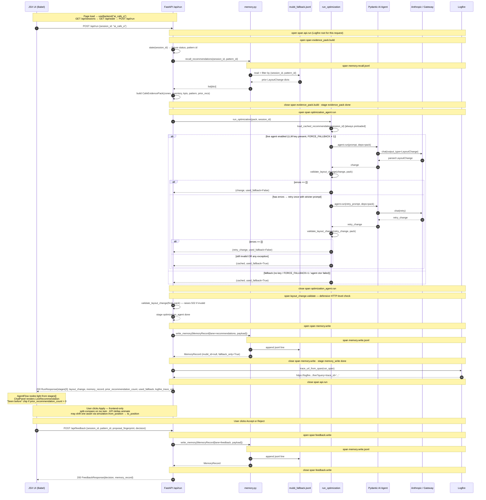

# CafeTwin / SimCafe — Engineering Plan

## Purpose

Detailed implementation plan for engineers. Aligns with `overview_plan.md`. Time horizon is **~18h**. Build philosophy is locked:

```
MVP    = real intelligence (one Pydantic AI agent), mocked spectacle (existing JSX demo)
Tier 1 = realer perception (live KPI engine, PatternAgent)
Tier 2 = richer spectacle (SceneBuilderAgent, R3F twin, chat, scenario rail)
```

This document specifies **MVP** in full and gives upgrade contracts for Tier 1 / Tier 2. Anything not in MVP is a non-goal until MVP is green.

**Frontend strategy (locked):** the MVP keeps the existing `frontend/cafetwin.html` Babel-in-browser demo as the shell. We add a thin `frontend/api.js` and a `useBackend()` hook in `app-state.jsx`; existing components (`AgentFlow`, `ChatPanel`, `TopBar`, `ScenarioRail`) gain optional props that bind real backend data. No Vite port. The demo's hand-authored scenarios stay as decorative what-ifs; the agent contributes one chip (`recommended`) materialised from the real `LayoutChange`.

**The rule:** what is mock stays mock; what is real (or could be real with a small additive binding) gets wired in MVP. Tier 1 / Tier 2 add the rest. No existing JSX file is rewritten. The canonical real/mock inventory per UI surface lives in `overview_plan.md` §Frontend strategy → "What's real vs mock in the MVP UI"; this engineering plan should not duplicate it.

## Visual Architecture — module-level, per tier

Three views of the same system. Each tier strictly adds to the previous one — boxes marked `(NEW)` are the additions vs the prior tier. Tiers are gated on the previous tier being green and stable.

Legend: `[REAL]` = live code at demo time. `[mock]` = fixture or prebaked artifact. `(NEW)` = added in this tier.

### MVP — real intelligence, mocked spectacle

```text
  ── PERCEPTION (mocked) ───────────  ── INTELLIGENCE (REAL · one agent) ───  ── PRESENTATION (existing JSX) ──

  demo_data/                          app/                                     frontend/  (Babel-in-browser)
  ┌───────────────────────────┐       ┌──────────────────────────────────┐    ┌─────────────────────────────┐
  │ zones.json           [mock]│      │ evidence_pack.py          [REAL] │    │ cafetwin.html               │
  │ object_inventory.json[mock]│      │   build() → CafeEvidencePack     │    │ + api.js          (NEW)      │
  │ kpi_windows.json     [mock]│ ───▶ │   ↳ recall_prior_recommendations │    │ + useBackend()    (NEW)      │
  │ pattern_fixture.json [mock]│      │                                  │    │                              │
  │ recommendation.cached[mock]│      │ agents/optimization_agent.py     │    │ TopBar (logfire URL wired)   │
  └────────────┬──────────────┘       │   Pydantic AI · Claude    [REAL] │──▶ │ AgentFlow (5 nodes ← stages) │
               │                      │   ↳ retry-once + validate        │    │ KPI cards (kpi_windows)      │
               │                      │   ↳ fallback to cached           │    │ ChatPanel ToolCall renders   │
               │                      │                                  │    │   real LayoutChange + Apply  │
               │                      │ memory.py                 [REAL] │    │ ScenarioRail: synthesized    │
               │                      │   write_memory()   ┐             │    │   presets + recommended chip │
               │                      │   recall_prior_…() │             │    │   (built from LayoutChange)  │
               │                      └────────┬───────────┴──┬──────────┘    │ Iso twin (cafe-iso.jsx)      │
               │                               │              │               │   split-compare on Apply,    │
               │                               ▼              ▼               │   optionally shifts target   │
               │                      ┌──────────────┐  ┌──────────────────┐  │   asset by simulation.delta  │
               │                      │ MuBit        │  │ mubit_fallback   │  │ Memories modal (NEW)         │
               │                      │  (primary)   │  │  .jsonl          │  └─────────────▲───────────────┘
               │                      └──────┬───────┘  └─────────┬────────┘                │
               │                             │                    │                         │
               │                             └─────────┬──────────┘  /api/memories          │
               │                                       ▼              ───────────────────────
               │                            ┌──────────────────────┐
               └───────────────────────────▶│ Logfire   one trace  │
                                            │ /api/run:    4 spans │
                                            │ /api/feedback: 1 span│
                                            └──────────────────────┘

  Routes: GET /api/sessions, GET /api/state, POST /api/run, POST /api/feedback,
          GET /api/memories, GET /api/logfire_url
```

### Tier 1 — realer perception (only if MVP green)

Perception layer becomes live. Intelligence and presentation layers untouched. **Adds 3 memory lanes and 3 Logfire spans.**

```text
  ── PERCEPTION (now REAL) ─────────  ── INTELLIGENCE (REAL, unchanged) ──   ── PRESENTATION (still mocked shell)

  ┌─────────────────────────────┐
  │ scripts/run_yolo_offline.py │     (same app/ as MVP)                    (same frontend/ as MVP)
  │   YOLO + ByteTrack    (NEW) │
  │   → tracks.cached.json[REAL]│ ─┐
  └─────────────────────────────┘  │
                                   │
  ┌─────────────────────────────┐  │  ┌────────────────────────────────┐
  │ scripts/render_annotated.py │  │  │ evidence_pack.py        [REAL] │
  │   ffmpeg overlays     (NEW) │  ├─▶│   build() → CafeEvidencePack   │
  │   → annotated_before.mp4    │  │  │                                │
  └─────────────────────────────┘  │  │ kpi_engine.py           (NEW)  │
                                   │  │   compute_window()      [REAL] │
  ┌─────────────────────────────┐  │  │   → list[KPIReport]            │
  │ zones.json (still hand-drawn,│ ─┤  │                                │
  │  no zone agent in any tier) │  │  │ agents/pattern_agent.py (NEW)  │
  └─────────────────────────────┘  │  │   Pydantic AI           [REAL] │
                                   │  │   → OperationalPattern         │
  ┌─────────────────────────────┐  │  │   (or deterministic builder)   │
  │ object_inventory.json [mock]│ ─┘  │                                │
  │  (manual review of YOLO)    │     │ agents/optimization_agent.py   │
  └─────────────────────────────┘     │   (unchanged)           [REAL] │
                                      └─────────────┬──────────────────┘
  pattern_fixture.json — REMOVED                    │
  (replaced by live PatternAgent)                   ▼
                                          ┌────────────────────┐
                                          │ memory.py  (NEW writes:
                                          │   kpi · inventory · pattern)
                                          │   on top of MVP writes
                                          └─────┬──────────┬───┘
                                                ▼          ▼
                                          MuBit (+ lanes:    jsonl
                                          location:demo:kpi
                                          location:demo:inventory
                                          location:demo:patterns)
                                                │
                                                ▼
                                         Logfire (NEW spans:
                                          kpi_engine.compute_window × N
                                          pattern_agent.run
                                          memory.write × 3)
```

### Tier 2 — richer spectacle (only if Tier 1 green)

Presentation layer upgrades. Backend gains a second agent. **Adds SceneBuilderAgent, /api/apply, optional R3F, activated chat.**

```text
─── PERCEPTION (Tier 1, REAL · unchanged) ──────────────────────────────────────

  tracks.cached.json [REAL] · kpi_windows (live engine) [REAL]
  zones.json [mock]          · object_inventory.json    [mock]
  pattern via PatternAgent (or deterministic builder)   [REAL]

─── INTELLIGENCE (Tier 1 + one new agent) ──────────────────────────────────────

  ┌────────────────────────────────────┐  ┌────────────────────────────────────┐
  │ optimization_agent.py       [REAL] │  │ scene_builder_agent.py     (NEW)   │
  │   (unchanged from MVP/Tier 1)      │  │   Pydantic AI · Claude     [REAL]  │
  │   → LayoutChange                   │  │   emits TwinLayout                 │
  └────────────────────────────────────┘  │   called twice per demo:           │
                                          │     mode=observed   ← inventory    │
                                          │    mode=recommended ← LayoutChange │
                                          │   ↳ retry + validate + cached      │
                                          └────────────────────────────────────┘

─── PRESENTATION (richer JSX shell, optionally Vite-ported) ────────────────────

  ┌────────────────────────────────────────────────────────────────────────────┐
  │ TopBar                          [REAL]  unchanged from MVP                 │
  │ Recommendation card             [REAL]  unchanged from MVP                 │
  │                                                                            │
  │ Flow canvas (7 nodes)           (NEW)   per-span animation from Logfire    │
  │ Twin panel                      (NEW)   R3F box prefabs ← reads TwinLayout │
  │                                          iso renderer = ?lowend=1 fallback │
  │ Scenario rail                   (NEW)   2–3 prebaked concept chips         │
  │                                          (each = one SceneBuilderAgent run)│
  │ Chat input                      (NEW)   activated, supported-prompts-only  │
  │ Memory timeline                 (NEW)   rich UI with previews              │
  │ Hyper3D hero asset (optional)   [mock]  one prebaked GLB if time permits   │
  └────────────────────────────────────────────────────────────────────────────┘

  Backend additions:
    POST /api/apply           SceneBuilderAgent → recommended TwinLayout
    GET  /api/twin/{scenario} (optional) parsed layout for scenario rail
    /api/chat                 (optional) routed supported prompts

  Sponsor integrations: none new.
```

### Cross-tier component status

| Component | MVP | Tier 1 | Tier 2 |
|---|---|---|---|
| `zones.json` | hand-drawn | hand-drawn (no zone agent ever) | hand-drawn |
| `tracks.cached.json` | hand-authored or skipped | live YOLO+ByteTrack offline | same as Tier 1 |
| `kpi_windows.json` | precomputed numbers | live `kpi_engine` per request | same as Tier 1 |
| `pattern_fixture.json` | hand-authored | replaced by `PatternAgent` (or builder) | same as Tier 1 |
| `OptimizationAgent` | live Pydantic AI | unchanged | unchanged |
| `SceneBuilderAgent` | **not in MVP** | not in Tier 1 | live Pydantic AI (2 calls) |
| MuBit lanes | recommendations, feedback | + kpi, inventory, patterns | same as Tier 1 |
| Frontend | existing `cafetwin.html` + JSX (Babel-in-browser) + new `api.js` | same as MVP | same JSX shell, optionally Vite/TS-ported once locked |
| Twin panel | existing iso renderer (`cafe-iso.jsx`), driven by demo presets + optional `simulation` shift | same as MVP | R3F box prefabs reading `TwinLayout`; iso = lowend fallback |
| Chat | input visible but disabled / hidden | same as MVP | input activated; supported-prompts-only |
| Scenario rail | demo presets + 1 agent-driven `recommended` chip | same as MVP | + 2–3 prebaked concept chips (each = one `SceneBuilderAgent` call) |
| Logfire span count | 4 on `/api/run` + 1 on `/api/feedback` | +KPI +pattern +extra writes | + scene_builder spans on `/api/apply` |
| Routes | `/api/sessions`, `/api/state`, `/api/run`, `/api/feedback`, `/api/memories`, `/api/logfire_url` | same as MVP | + `/api/apply`, optional `/api/twin/{scenario}`, `/api/chat` |
| Sponsor services | Anthropic, MuBit, Logfire | + (none) | + (none) |

### Sponsor services used at demo time (all tiers)

- **Anthropic Claude** — drives `OptimizationAgent` (and `PatternAgent` in Tier 1+, `SceneBuilderAgent` in Tier 2). MVP agent falls back to cached JSON on failure.
- **MuBit** — `remember()` for memory writes; `recall()` for prior recommendations. Degrades silently when `MUBIT_API_KEY` unset.
- **Logfire** — auto-instruments Pydantic AI; manual spans for evidence pack build, KPI compute (Tier 1), validation, memory write, MuBit recall.
- **Render** — backend hosting (configured at deploy time, not visible in the runtime diagrams above).

## Sequence — `/api/run` and `/api/feedback`

What happens end-to-end when the demo loads and when the user clicks **Accept** / **Reject**. Every arrow is a real function call or network hop at demo time.

The diagram below mirrors the current code (MVP). MuBit is intentionally
omitted — `memory.py` is jsonl-only today; MuBit hops are Tier 1 and noted in
the "Future" notes underneath.



### Mapping: sequence steps → Logfire spans (current code)

`/api/run` produces this nested tree under the root `api.run` span:

| Concern | Span (parent → children) |
|---|---|
| Evidence + recall | `evidence_pack.build` → `memory.recall.jsonl` |
| Recommendation | `optimization_agent.run` (wraps `run_optimization`; nested pydantic-ai auto-spans appear when `instrument_pydantic_ai()` is active) |
| Validate (HTTP check) | `layout_change.validate` |
| Memory write | `memory.write` → `memory.write.jsonl` |

`/api/feedback`:

| Concern | Span (parent → children) |
|---|---|
| Feedback write | `feedback.write` → `memory.write.jsonl` |

Tier 1 / Tier 2 add-ons (not in MVP, sketched for context only):

- `memory.write.mubit` and `memory.recall.mubit` siblings of the existing
  jsonl spans, once `memory.py` calls MuBit's `remember` / `query`.
- `kpi_engine.compute_window` × N (Tier 1, replacing precomputed
  `kpi_windows.json`).
- `pattern_agent.run` (Tier 1) between `evidence_pack.build` and
  `optimization_agent.run`.
- `scene_builder_agent.run` × 2 (Tier 2, on `/api/apply`) producing observed
  + recommended `TwinLayout`s.

### Frontend stage timestamps → flow canvas nodes

`RunResponse.stages[]` carries 3 entries: `evidence_pack`, `optimization_agent`, `memory_write`. The existing demo's [AgentFlow](frontend/app-panels.jsx) shows 5 visual nodes. Map them as:

| Visual node (in `app-panels.jsx`) | Driven by `StageTiming.name` | What lights up |
|---|---|---|
| `vision` | `evidence_pack` | Object inventory + zones loaded into the pack |
| `kpi` | `evidence_pack` | KPI windows loaded into the pack |
| `pattern` | `evidence_pack` | Pattern fixture loaded into the pack |
| `optimize` | `optimization_agent` | OptimizationAgent + validate + retry/fallback |
| `simulate` (relabel to `memory` for honesty) | `memory_write` | MuBit + jsonl write |

All five light up sequentially on the single `/api/run` call. Latency badges on each node read `ended_at - started_at` for that stage; the three `evidence_pack`-driven nodes share a latency or split it visually. In Tier 2, `SceneBuilderAgent` adds two stages (`scene_build.observed` and `scene_build.recommended`) which can populate `pattern` and `simulate` (renamed `scene`) honestly.

## Demo loop (MVP)

```
fixtures (loaded once per session selection)
  ↓
GET /api/sessions ─────────────────────────────────
  list of SessionManifest (ai_cafe_a + any authored alternates)
  ↓
GET /api/state?session_id=ai_cafe_a ───────────────
  fixture status + KPI windows + zones + object inventory + pattern
  ↓
POST /api/run {session_id: ai_cafe_a} ─────────────
  recall_recommendations(session_id, pattern.id)   (jsonl-only today; MuBit is Tier 1)
  ↓
  build CafeEvidencePack(session_id, prior_recommendations=...)   (typed input bundle)
  ↓
  run_optimization                          (Pydantic AI, retry-once on validation, cached fallback)
  ↓
  validate_layout_change (defensive HTTP check) → 502 if still invalid
  ↓
  memory.write (lane=recommendations)       (jsonl-only; MuBit primary lands in Tier 1)
  ↓
  UI binds RunResponse: AgentFlow nodes light from stages[]; ChatPanel ToolCall
  renders the real LayoutChange; ScenarioRail materialises a `recommended` chip;
  TopBar Logfire link uses logfire_trace_url; "Seen before" chip if
  prior_recommendation_count > 0
  ↓
user clicks Apply (or selects the recommended chip)
  ↓
  Frontend-only: iso twin enters split-compare; KPI delta cards on the
  recommended chip animate from LayoutChange.expected_kpi_delta;
  optionally one asset visibly shifts using simulation.from_position/to_position
  ↓
user clicks Accept / Reject
  ↓
POST /api/feedback ─────────────────────────────────
  memory.write (lane=feedback)              (jsonl-only)
  ↓
  UI: toast confirms; Memories modal (next open) shows the new entry
  (mubit_id stays null until Tier 1 wires MuBit primary writes)
```

One Logfire trace per `/api/run`, root span `api.run` with this nested tree:

1. `evidence_pack.build` (+ child `memory.recall.jsonl`)
2. `optimization_agent.run` (auto-instrumented when `instrument_pydantic_ai()` is active)
3. `layout_change.validate`
4. `memory.write` (+ child `memory.write.jsonl`)

Plus a smaller `/api/feedback` trace:

5. `feedback.write` (+ child `memory.write.jsonl`)

Tier 1 will add sibling `memory.recall.mubit` / `memory.write.mubit` spans
under (1) and (4)/(5) once `memory.py` calls MuBit's `query` / `remember`.

## File layout

```
app/
  schemas.py                    # all Pydantic models — implemented; SessionManifest to add
  evidence_pack.py              # build(session_id) → CafeEvidencePack reading from sessions/<id>/
  agents/
    optimization_agent.py       # live Pydantic AI agent → LayoutChange
    # scene_builder_agent.py    # Tier 2 only
  memory.py                     # local jsonl writer + MuBit best-effort wrapper
  logfire_setup.py              # init + span helpers
  api/
    main.py                     # FastAPI app + CORSMiddleware
    routes.py                   # /api/sessions, /api/state, /api/run, /api/feedback, /api/memories, /api/logfire_url
  fallback.py                   # load sessions/<id>/recommendation.cached.json when the agent fails
  config.py                     # env vars, demo_data path
  sessions.py                   # discover sessions/<slug>/, parse SessionManifest, validate fixture presence
cafe_videos/                    # three CCTV source videos (already in repo)
  real_cctv.mp4
  ai_generated_cctv.mp4
  ai_generated_cctv_round.mp4
demo_data/
  sessions/
    ai_cafe_a/                  # MVP mock — must ship
      session.json
      zones.json
      object_inventory.json
      kpi_windows.json
      pattern_fixture.json
      recommendation.cached.json
    real_cafe/                  # Tier 1 only — pairs with live YOLO on real_cctv.mp4
  mubit_fallback.jsonl          # shared across sessions, payloads include session_id
frontend/                       # existing Babel-in-browser demo — bind backend, do not rewrite
  cafetwin.html                 # shell (already built; add memories modal + optional session selector)
  app-state.jsx                 # add useBackend(sessionId) + scenarioFromLayoutChange()
  app-canvas.jsx                # iso twin canvas + split-compare (already built)
  app-panels.jsx                # TopBar, AgentFlow, ChatPanel, ScenarioRail (bind backend props)
  cafe-iso.jsx                  # SVG iso renderer (already built)
  tweaks-panel.jsx              # editable tweaks panel (already built; gains session select)
  cafetwin.css                  # 32KB stylesheet (already built)
  api.js                        # NEW: fetch wrappers — listSessions, getState, postRun, postFeedback, getMemories, getLogfireUrl
scripts/
  build_fixtures.py             # one-shot per session: ffmpeg representative-frame extract + hand-author scaffolding
  run_yolo_offline.py           # Tier 1 hook: produce real tracks.cached.json per session
```

Current status (2026-04-26): `pyproject.toml`, `app/`, `app/api/`,
`app/agents/`, `demo_data/`, `frontend/`, `scripts/`, and
`docs/architecture/` exist. `app/schemas.py` is implemented with strict
Pydantic models for fixtures, `CafeEvidencePack`, `LayoutChange`, memory
records, API responses, and Tier 2 twin layouts. `demo_data/sessions/ai_cafe_a/`
now contains the extracted 5s frame and all six required JSON fixtures.
`app/evidence_pack.py`, `app/sessions.py`, `app/fallback.py`, `app/memory.py`,
and `app/api/routes.py` provide the first test-backed backend spine for the six
MVP routes. `OptimizationAgent` now retries semantic validation failures once
before using the cached recommendation, and `/api/memories?session_id=...`
filters local jsonl records server-side by `payload.session_id`. `tests/`
covers the fixture contract, route response models, agent semantic retry, and
memory filtering (`pytest` 10 passed; `ruff check app tests` passed). `.agents/`
is local-only coordination/skills state and is ignored; `.agents/handoff.md`
should be read and updated during multi-agent work but not committed.

Next implementation step: bind the existing Babel-in-browser frontend to these
route shapes while tightening MuBit and Logfire behavior behind the
already-working fallback path.

## Demo data contract (MVP fixtures)

CCTV videos in `cafe_videos/` seed sessions. Each session is a self-contained fixture pack hand-derived from a representative frame of its source video.

### Sessions

| Session slug | Source video | Status |
|---|---|---|
| `ai_cafe_a` | `cafe_videos/ai_generated_cctv.mp4` (1924×1076 / 24fps / 15s) | **MVP — must ship.** Controlled AI-generated CCTV mock; fastest path to a clean fixture pack. |
| `real_cafe` | `cafe_videos/real_cctv.mp4` (1280×720 / 30fps / 49s) | **Tier 1 only.** Authored once `scripts/run_yolo_offline.py` produces real `tracks.cached.json` for it. Carries the "real video" pitch beat when Tier 1 ships. |

`cafe_videos/ai_generated_cctv_round.mp4` is held in repo as raw material; no session is authored against it for MVP or Tier 1.

### Per-session files

For each `<slug>` under `demo_data/sessions/<slug>/`:

| File | Schema | Notes |
|---|---|---|
| `session.json` | `SessionManifest` (new schema, see below) | Slug, label, video relative path, source kind (`real` or `ai_generated`), notes. |
| `zones.json` | `list[Zone]` | Hand-drawn polygons traced from the representative frame. Loaded into `CafeEvidencePack`. |
| `object_inventory.json` | `ObjectInventory` | Hand-authored counts + `center_xy` in the video's pixel coordinate space. Loaded into `CafeEvidencePack`. |
| `kpi_windows.json` | `list[KPIReport]` | 3–4 precomputed windows with plausible numbers consistent with the visible activity. The pattern fixture's `evidence_ids` cite these windows' `memory_id`. |
| `pattern_fixture.json` | `OperationalPattern` | One pattern. The agent **must** cite its `evidence[*].memory_id` values. |
| `recommendation.cached.json` | `LayoutChange` | Deterministic fallback used if the agent retries fail validation for this session. |
| `frame.jpg` (optional) | image | The representative frame used to derive the fixtures. Pulled with `ffmpeg -ss 5 -i <video> -frames:v 1 frame.jpg`. Useful for debugging / regenerating fixtures. |

### Global files

| File | Schema | Notes |
|---|---|---|
| `cafe_videos/real_cctv.mp4`, `ai_generated_cctv.mp4`, `ai_generated_cctv_round.mp4` | binary | Already in repo. Not parsed by backend at runtime. Optionally streamed by the frontend if the canvas's `view` segment grows a `video` mode. |
| `demo_data/sessions/<slug>/tracks.cached.json` | `list[TrackPoint]` | Tier 1 only — produced offline by `scripts/run_yolo_offline.py <session_id>`. Not used in MVP. |
| `demo_data/sessions/<slug>/twin_observed.json` / `twin_recommended.json` | `TwinLayout` (Tier 2 schema) | Tier 2 R3F input. Not used in MVP — the iso renderer synthesises its scene from demo presets. |
| `demo_data/mubit_fallback.jsonl` | append-only | Created at runtime. Shared across sessions. Each record's payload includes `session_id` so the Memories modal can filter. |

### `SessionManifest` schema

Add to `app/schemas.py`:

```python
class SessionManifest(StrictModel):
    slug: str                              # e.g. "ai_cafe_a"
    label: str                             # human-readable, e.g. "AI cafe A (mock CCTV)"
    video_path: str                        # relative path, e.g. "cafe_videos/ai_generated_cctv.mp4"
    source_kind: Literal["real", "ai_generated"]
    notes: str | None = None
    representative_frame_idx: int | None = None
```

`evidence_pack.build(session_id)` resolves files under `demo_data/sessions/<session_id>/`. If `session_id` is unset, defaults to `"ai_cafe_a"`. Missing files → `/api/state` returns a clear error (no silent fallback to a different session).

**Failure rule:** if any required fixture for the active session is missing at startup, `/api/state?session_id=...` returns a clear error with the missing filename. Don't paper over it or silently fall back to another session.

## Schemas

```python
from datetime import datetime
from typing import Literal
from uuid import UUID, uuid4

from pydantic import BaseModel, Field

# ---------- Vision-shaped (used as fixture inputs in MVP) ----------

ObjectKind = Literal[
    "table", "chair", "counter", "pickup_shelf",
    "queue_marker", "menu_board", "plant", "barrier",
]


class SceneObject(BaseModel):
    id: str
    kind: ObjectKind
    label: str
    bbox_xyxy: tuple[float, float, float, float]
    center_xy: tuple[float, float]
    size_xy: tuple[float, float]
    rotation_degrees: float = 0
    zone_id: str | None = None
    movable: bool = True
    confidence: float
    source: Literal["vision", "manual", "fixture"] = "fixture"


class ObjectInventory(BaseModel):
    session_id: str           # slug, e.g. "ai_cafe_a"
    run_id: UUID
    source_frame_idx: int
    source_timestamp_s: float
    objects: list[SceneObject]
    counts_by_kind: dict[ObjectKind, int]
    count_confidence: float
    notes: list[str] = Field(default_factory=list)


class TrackPoint(BaseModel):
    track_id: int
    role: Literal["staff", "customer", "unknown"] = "unknown"
    timestamp_s: float
    x: float
    y: float
    zone_id: str | None = None


class Zone(BaseModel):
    id: str
    name: str
    kind: Literal["counter", "queue", "pickup", "seating", "staff_path", "entrance"]
    polygon: list[tuple[float, float]]
    color_hex: str = "#64748b"
    source: Literal["agent_drafted", "manual", "fixture"] = "fixture"
    confidence: float | None = None


# ---------- KPI ----------

KPIField = Literal[
    "staff_walk_distance_px",
    "staff_customer_crossings",
    "queue_obstruction_seconds",
    "congestion_score",
    "table_detour_score",
]


class KPIReport(BaseModel):
    window_start_s: float
    window_end_s: float
    frames_sampled: int
    staff_walk_distance_px: float
    staff_customer_crossings: int
    queue_length_peak: int
    queue_obstruction_seconds: float
    congestion_score: float
    table_detour_score: float
    session_id: str           # slug, e.g. "ai_cafe_a"
    run_id: UUID
    memory_id: str  # e.g. "mem_kpi_w1"; cited by patterns


# ---------- Pattern (fixture in MVP, agent in Tier 1) ----------

class EvidenceRef(BaseModel):
    memory_id: str
    lane: str
    summary: str
    kpi_field: KPIField | None = None


class OperationalPattern(BaseModel):
    id: str  # e.g. "pat_queue_crossing_001"
    title: str
    summary: str
    pattern_type: Literal[
        "queue_crossing", "staff_detour", "table_blockage", "pickup_congestion"
    ]
    evidence: list[EvidenceRef] = Field(min_length=1)
    severity: Literal["low", "medium", "high"]
    affected_zones: list[str]


# ---------- Agent input bundle ----------

class CafeEvidencePack(BaseModel):
    """Single typed input to OptimizationAgent.
    Built by `evidence_pack.build(session_id)` from demo_data fixtures (MVP)
    or live KPI engine output (Tier 1).
    """
    session_id: str                                # slug, e.g. "ai_cafe_a"
    run_id: UUID = Field(default_factory=uuid4)
    zones: list[Zone]
    object_inventory: ObjectInventory
    kpi_windows: list[KPIReport]
    pattern: OperationalPattern  # MVP: the fixture pattern. Tier 1: PatternAgent output.
    org_rules: list[str] = Field(default_factory=list)
    prior_recommendations: list["LayoutChange"] = Field(default_factory=list)
    # Populated by mubit.recall(session_id, pattern_id). Empty list if MuBit
    # unavailable or no prior runs — agent handles both cases. Recall is
    # scoped to (session_id, pattern_id) so cafes never see each other's
    # recommendations.


# ---------- Agent output ----------

class LayoutSimulation(BaseModel):
    """Single-action MVP simulation spec. Renamed from `SimulationSpec` to
    avoid collision with the Tier-2 multi-op `SimulationSpec` in the UI spec
    (§3.5 of `docs/superpowers/specs/2026-04-25-simcafe-ui-design.md`).
    """
    action: Literal["move_table", "move_chair", "move_station", "change_queue_boundary"]
    target_id: str
    from_position: tuple[float, float]
    to_position: tuple[float, float]
    rotation_degrees: float = 0


class LayoutChange(BaseModel):
    """Pure agent output — does NOT carry session_id / pattern_id. The
    orchestrator wraps it in `RecommendationMemoryPayload` (below) when
    persisting, so recall scoping stays out of the LLM's schema.
    """
    title: str
    rationale: str
    target_id: str
    simulation: LayoutSimulation
    evidence_ids: list[str] = Field(min_length=1)  # MUST be subset of pattern.evidence ids
    expected_kpi_delta: dict[KPIField, float] = Field(min_length=1)
    confidence: float = Field(ge=0.0, le=1.0)
    risk: Literal["low", "medium", "high"]
    fingerprint: str


# ---------- Memory write payloads ----------

class RecommendationMemoryPayload(BaseModel):
    """Wraps a `LayoutChange` with the scoping fields needed by recall.
    Stored as `MemoryRecord.payload` for lane=recommendations.
    """
    session_id: str          # slug, e.g. "ai_cafe_a" — recall filters on this
    pattern_id: str          # the OperationalPattern.id this proposal addresses
    layout_change: LayoutChange


class FeedbackMemoryPayload(BaseModel):
    """Stored as `MemoryRecord.payload` for lane=feedback."""
    session_id: str
    pattern_id: str
    proposal_fingerprint: str
    decision: Literal["accept", "reject"]


class MemoryRecord(BaseModel):
    lane: Literal[
        "location:demo:recommendations",
        "location:demo:feedback",
        # Tier 1 lanes:
        "location:demo:kpi",
        "location:demo:inventory",
        "location:demo:patterns",
    ]
    intent: Literal["fact", "lesson", "feedback", "rule", "trace"]
    payload: dict           # validated via the per-lane payload models above
    written_at: datetime
    mubit_id: str | None = None
    fallback_only: bool = False
```

Notes:

- `LayoutChange` stays a pure agent-output type; `session_id` / `pattern_id` ride on the `RecommendationMemoryPayload` wrapper, so the LLM never has to copy them and recall stays correctly scoped.
- `evidence_ids` is a flat `list[str]` rather than `list[EvidenceRef]` to make the Pydantic AI prompt simpler and the post-validation trivial.
- `expected_kpi_delta` keys are typed via `KPIField` literal, so the agent cannot hallucinate field names.
- `confidence` is bounded `[0,1]` by `Field`.

## OptimizationAgent (live, MVP)

**Input:** `CafeEvidencePack`. **Output:** `LayoutChange`.

### Pydantic AI setup

```python
import os
from pydantic_ai import Agent
from app.schemas import CafeEvidencePack, LayoutChange

optimization_agent: Agent[CafeEvidencePack, LayoutChange] | None = Agent(
    _agent_model_spec(),  # defaults to gateway/anthropic:claude-sonnet-4-6 when Gateway key exists
    deps_type=CafeEvidencePack,
    output_type=LayoutChange,
    instructions=OPTIMIZATION_INSTRUCTIONS,
    retries=1,
)
```

`CAFETWIN_OPTIMIZATION_MODEL` stays overrideable for demo tuning. Per the
Pydantic AI Gateway docs, the Gateway string form is
`gateway/<api_format>:<model_name>`, e.g.
`gateway/anthropic:claude-sonnet-4-6`. If the Pydantic/Logfire org uses a custom
provider/routing-group name, set `PYDANTIC_AI_GATEWAY_ROUTE` or
`CAFETWIN_GATEWAY_ROUTE`; the backend will build an explicit Gateway provider
with `gateway_provider("anthropic", route=...)`.

### System prompt (contract)

```text
You are a cafe layout optimization agent. You receive a CafeEvidencePack
describing zones, an object inventory, KPI windows, and one OperationalPattern
identifying a spatial bottleneck. Your job is to emit a single typed
LayoutChange that addresses the pattern.

HARD RULES — you will be rejected if you violate any of these:

1. evidence_ids MUST be a non-empty subset of the memory_ids appearing in
   the input pattern.evidence[*].memory_id. Do not invent IDs.
2. expected_kpi_delta MUST contain at least one key from this set:
   {staff_walk_distance_px, staff_customer_crossings,
    queue_obstruction_seconds, congestion_score, table_detour_score}.
   Values are signed floats representing expected change (negative = improvement
   for distance/crossings/obstruction/congestion; lower table_detour_score is also
   better).
3. simulation.target_id MUST refer to an existing object in
   object_inventory.objects[*].id, or a zone id from zones[*].id for
   change_queue_boundary actions.
4. simulation.from_position MUST equal the current center_xy of that object
   (within 1px tolerance) when target is movable furniture.
5. confidence MUST be in [0.0, 1.0] and risk MUST be one of {low, medium, high}.
6. fingerprint MUST be a short stable hash-like string of (target_id, action,
   to_position) so duplicates can be detected.

Prefer ONE high-confidence move. Keep rationale to 2-3 sentences citing the
specific pattern. Do not propose multiple changes.

If prior_recommendations is non-empty, briefly acknowledge in the rationale
that this pattern has been seen before (e.g. "Repeats a prior recommendation
that was accepted"). If empty, do not mention prior memory.
```

### Post-validation + fallback

After the agent returns, we run a second-pass validator before returning to the UI:

```python
def validate_layout_change(change: LayoutChange, pack: CafeEvidencePack) -> list[str]:
    pattern_ids = {ref.memory_id for ref in pack.pattern.evidence}
    errors = []
    if not change.evidence_ids:
        errors.append("missing evidence_ids")
    if not set(change.evidence_ids).issubset(pattern_ids):
        errors.append("evidence_ids outside pattern evidence")
    if not change.expected_kpi_delta:
        errors.append("missing expected_kpi_delta")
    object_ids = {o.id for o in pack.object_inventory.objects}
    if change.simulation.target_id not in object_ids:
        errors.append("simulation target not in inventory")
    return errors


async def run_optimization(pack: CafeEvidencePack, session_id: str) -> tuple[LayoutChange, bool]:
    """Returns (layout_change, used_fallback)."""
    with logfire.span("optimization_agent.run", session_id=pack.session_id):
        try:
            result = await optimization_agent.run(_optimization_prompt(pack), deps=pack)
            change = result.output
        except Exception as e:
            logfire.warn("optimization_agent failed", error=str(e))
            return load_cached_recommendation(session_id), True

    with logfire.span("layout_change.validate"):
        errors = validate_layout_change(change, pack)
        if not errors:
            return change, False
        # Retry once with a stricter reminder in the full live-agent path.
        retry = await optimization_agent.run(_retry_prompt(pack, change, errors), deps=pack)
        if not validate_layout_change(retry.output, pack):
            return retry.output, False
        logfire.warn("optimization_agent validation failed twice, using fallback")
        return load_cached_recommendation(session_id), True
```

`load_cached_recommendation(session_id)` reads `demo_data/sessions/<session_id>/recommendation.cached.json` and returns it parsed as `LayoutChange`. Each session ships its own cached fallback that must satisfy `validate_layout_change` against that session's fixture pack — see §Acceptance checks.

## Memory layer

MuBit is the **primary** memory store in MVP. The local jsonl is a hot fallback that is always written so a MuBit outage at demo time degrades gracefully (no demo break). The UI reads from MuBit when available, jsonl when not.

```python
# app/memory.py
import json
from pathlib import Path
from datetime import datetime, timezone

JSONL_PATH = Path("demo_data/mubit_fallback.jsonl")


async def write_memory(record: MemoryRecord) -> MemoryRecord:
    record.written_at = datetime.now(timezone.utc)

    # 1) MuBit (primary)
    with logfire.span("memory.write.mubit"):
        try:
            record.mubit_id = await _mubit_remember(record)
        except Exception as e:
            logfire.warn("mubit write failed; jsonl-only", error=str(e))
            record.fallback_only = True

    # 2) Local jsonl (always, as fallback + audit log)
    with logfire.span("memory.write.jsonl"):
        with JSONL_PATH.open("a") as f:
            f.write(record.model_dump_json() + "\n")

    return record


async def recall_prior_recommendations(
    session_id: str,
    pattern_id: str,
    limit: int = 3,
) -> list[LayoutChange]:
    """Recall prior LayoutChange recommendations for this session+pattern.
    Scoping by both keys ensures cafes never see each other's recommendations
    even if pattern_ids collide. Returns [] if MuBit unavailable or no matches.
    """
    with logfire.span("mubit.recall", session_id=session_id, pattern_id=pattern_id):
        if not _mubit_available():
            return []
        try:
            hits = await _mubit_query(
                lane="location:demo:recommendations",
                filters={"session_id": session_id, "pattern_id": pattern_id},
                limit=limit,
            )
            return [
                RecommendationMemoryPayload.model_validate(h.payload).layout_change
                for h in hits
            ]
        except Exception as e:
            logfire.warn("mubit recall failed; returning empty", error=str(e))
            return []
```

If `MUBIT_API_KEY` is unset, both `_mubit_remember` and `_mubit_query` no-op cleanly: writes still hit jsonl, recalls return `[]`, demo still works. This is what `MemoryRecord.fallback_only` flags.

### MVP writes

- After successful recommendation: one `MemoryRecord` on lane `location:demo:recommendations`, intent `lesson`, with `payload = RecommendationMemoryPayload(session_id, pattern_id, layout_change).model_dump()`. The `session_id` + `pattern_id` are read from the `CafeEvidencePack`, not from the LLM output.
- After Accept/Reject feedback: one `MemoryRecord` on lane `location:demo:feedback`, intent `feedback`, with `payload = FeedbackMemoryPayload(session_id, pattern_id, proposal_fingerprint, decision).model_dump()`.

### MVP reads

- `evidence_pack.build(session_id)` calls `recall_prior_recommendations(session_id, pattern.id)` after loading the fixture pattern, and stores results in `pack.prior_recommendations`.
- `GET /api/memories?session_id=...` queries MuBit (lanes `location:demo:recommendations` + `location:demo:feedback`) and merges with jsonl entries, dedup by `mubit_id`. If MuBit unavailable, returns jsonl only. When `session_id` is provided, the backend filters via `payload.session_id`; without it, the endpoint returns all local records and the frontend may filter.

### UI surface

- Memories expander row shows `[mubit_id]` chip when present (e.g. `mem_a1b2c3`), or `[local]` when fallback-only.
- Recommendation card shows a "Seen before" chip with count when `prior_recommendations` is non-empty.

### Tier 1 adds

KPI summary, object inventory, and pattern writes on their own lanes (see `MemoryRecord.lane` literal). Recall is also extended to `location:demo:patterns` for pattern history.

## FastAPI routes

```python
# app/api/routes.py

# Request body schemas (add to app/schemas.py)
class RunRequest(BaseModel):
    session_id: str = "ai_cafe_a"

class FeedbackRequest(BaseModel):
    session_id: str
    pattern_id: str
    proposal_fingerprint: str
    decision: Literal["accept", "reject"]


@router.get("/api/sessions")
async def list_sessions() -> SessionsResponse:
    """Lists demo sessions discovered under demo_data/sessions/<slug>/.
    Loaded from each session's session.json. ai_cafe_a must always be
    present; other sessions appear only if their fixtures have been authored
    (real_cafe is Tier 1; see overview_plan.md).
    """

@router.get("/api/state")
async def get_state(session_id: str = "ai_cafe_a") -> StateResponse:
    """Fixture status + KPI windows + zones + object inventory + pattern for
    the requested session. Frontend hits this on mount before /api/run.
    Returns an explicit error if any required fixture is missing.
    """

@router.post("/api/run")
async def run(body: RunRequest) -> RunResponse:
    """Runs the full agentic chain for body.session_id. JSON response shape:
        {
          "stages": [
            {"name": "evidence_pack",      "started_at": "...", "ended_at": "..."},
            {"name": "optimization_agent", "started_at": "...", "ended_at": "..."},
            {"name": "memory_write",       "started_at": "...", "ended_at": "..."}
          ],
          "layout_change": <LayoutChange JSON>,
          "memory_record": <MemoryRecord JSON>,
          "prior_recommendation_count": 0,
          "used_fallback": false,
          "logfire_trace_url": "https://logfire.../trace/..."
        }
    """

@router.post("/api/feedback")
async def feedback(body: FeedbackRequest) -> FeedbackResponse:
    """Writes feedback memory scoped to (session_id, pattern_id, proposal_fingerprint)."""

@router.get("/api/logfire_url")
async def logfire_url() -> LogfireURLResponse:
    """Trace URL for the top-bar link, cached from the most recent /api/run span."""

@router.get("/api/memories")
async def memories(session_id: str | None = None) -> MemoriesResponse:
    """Merged MuBit + jsonl records, dedup by mubit_id. If session_id is
    provided, filters server-side via payload.session_id; otherwise returns
    all sessions and the frontend filters."""
```

`app/api/main.py` adds `CORSMiddleware` so the demo HTML (served at `file://` or
`http://localhost:8080`) can call the FastAPI backend on `localhost:8000` without
preflight failures.

`/api/apply` is **not** part of MVP — Apply is a frontend-only state change in
the existing JSX demo. It comes back in Tier 2 when `SceneBuilderAgent` lands.

SSE is optional polish, not MVP. If we add it later, it should preserve the same
stage names and response shapes so the frontend can replay either live or after
the request completes.

## Logfire

```python
# app/logfire_setup.py
import logfire
logfire.configure(
    service_name="cafetwin-mvp",
    environment="demo",
    send_to_logfire="if-token-present",
)
logfire.instrument_pydantic_ai()
# app/api/main.py calls logfire.instrument_fastapi(app) after FastAPI creation.
```

Span hierarchy for one `/api/run` call:

```
api.run (root)
├── evidence_pack.build
│   └── memory.recall.jsonl           (MuBit recall replaces/augments this later)
├── optimization_agent.run            (plus Pydantic AI auto-spans when live)
├── layout_change.validate
└── memory.write
    └── memory.write.jsonl            (MuBit child span lands with MuBit integration)
```

The Logfire URL is returned inline as `RunResponse.logfire_trace_url` (and also exposed at `/api/logfire_url` for the top-bar link to refresh independently). Cache it in process state when the run finishes.

Current verification: with `LOGFIRE_TOKEN`, `LOGFIRE_PROJECT_URL`, and Pydantic
AI Gateway env in local `.env`, a live `/api/run` smoke returns
`used_fallback=false`, a validated `LayoutChange`, a non-empty
`logfire_trace_url`, and a jsonl memory write. Latest observed live fingerprint:
`move_table_center_1_reduce_pickup_pinch_v1`.

Logfire's default scrub patterns redact keys containing `session`, so
`app/logfire_setup.py` installs a `ScrubbingOptions.callback` that allowlists
only simple public fixture `session_id` values such as `ai_cafe_a`. Optional
`session_id=None` arguments are reported as `unset` because Logfire's callback
API treats a returned `None` as "redact". Real session cookies, API keys, tokens,
and other sensitive values still use Logfire's default redaction.

## Frontend contract

The MVP frontend is the existing `frontend/cafetwin.html` Babel-in-browser demo (UMD React + `<script type="text/babel">`). Backend bindings are added additively via a new `frontend/api.js` and a `useBackend()` hook in `app-state.jsx`. Existing components grow optional props that render real data when present.

### API touchpoints

| User action | Frontend call | Existing component bound |
|---|---|---|
| Page load | `GET /api/sessions`, then `GET /api/state?session_id=...` and `POST /api/run {session_id}` for the active session (defaults to `ai_cafe_a`) | `useBackend(sessionId)` hook in `app-state.jsx`; results threaded down through `App()` in `cafetwin.html` |
| Switch session | (Tier 1) Re-issue `GET /api/state` + `POST /api/run` with the new `session_id` | Tier 1 adds the selector once `real_cafe` is authored; the routes already accept `session_id`, MVP just defaults it. |
| (Auto on response) | — | `AgentFlow` node states from `RunResponse.stages[]`; `ChatPanel` ToolCall rendering the real `LayoutChange`; `ScenarioRail` materialising a `recommended` chip; KPI cards from `kpi_windows`; "Seen before" chip from `prior_recommendation_count` |
| Click `recommended` chip / Apply | Frontend-only | Iso twin enters split-compare; KPI deltas animate from `expected_kpi_delta`; optional asset shift via `simulation.from_position`/`to_position` |
| Click "Accept" / "Reject" | `POST /api/feedback {session_id, pattern_id, proposal_fingerprint, decision}` | Toast confirmation; Memories modal refreshes on next open |
| Click Logfire link in `TopBar` | `window.open(logfire_trace_url)` (URL already returned by `/api/run`; `/api/logfire_url` is the manual-refresh path) | Existing TopBar button at `frontend/app-panels.jsx` |
| Open Memories modal | `GET /api/memories` | New modal cloning the `session.replay` modal pattern in `cafetwin.html` |

### What does **not** change in the existing demo

- `SCENARIO_PRESETS` and `computeKpis()` in `app-state.jsx` stay as-is. They power `baseline`, `10x.size`, `brooklyn`, `+2.baristas`, `tokyo` — all decorative and never claimed to be agent output.
- `cafe-iso.jsx`, `app-canvas.jsx`, `tweaks-panel.jsx`, `cafetwin.css` — untouched (with the optional small addition of an `assetOverrides` prop on the iso scene to support the `simulation` shift on the recommended pane).
- The HTML loader, the UMD React bundle, the Babel-standalone tag — untouched.

### What is added (additive only)

- `frontend/api.js` — ~40 lines of `fetch` wrappers exporting `listSessions`, `getState`, `postRun`, `postFeedback`, `getMemories`, `getLogfireUrl`.
- `frontend/cafetwin.html` — one new `<script src="api.js">` tag before the JSX scripts, and a new `<Modal open={openModal === "memories"}>` block alongside the existing modals.
- `frontend/app-state.jsx` — a `useBackend()` hook + a `scenarioFromLayoutChange(lc)` helper that converts a `LayoutChange` into the demo's scenario shape so the rail can render it.
- `frontend/app-panels.jsx` — `AgentFlow` accepts an optional `stages` prop; `ChatPanel` renders a real `LayoutChange` ToolCall + Apply/Accept/Reject buttons when a `layoutChange` prop is present; `TopBar` Logfire button uses `logfireUrl`.

## KPI engine (Tier 1, NOT MVP)

Pre-compute in MVP, ship live in Tier 1. Implementation reference (lifted from old plan):

- `staff_walk_distance_px`: Σ Euclidean distance between consecutive staff TrackPoints.
- `staff_customer_crossings`: count of (staff segment) × (customer segment) intersections per window.
- `queue_length_peak`/`avg`: count of customer points inside `queue` zone per frame.
- `queue_obstruction_seconds`: seconds where a staff segment enters queue zone or a table mask overlaps queue corridor.
- `congestion_score`: normalized density in counter+queue+pickup region (0..1).
- `table_detour_score`: actual staff path length / straight-line counter→seating distance.

Window size: 20s. Run on cached `tracks.cached.json` + `zones.json`. Output overwrites `kpi_windows.json` (or returns from API directly).

## Vision (Tier 1, NOT MVP)

Run offline once, not at demo time. Script: `scripts/run_yolo_offline.py`:

```python
from ultralytics import YOLO
import cv2, json

model = YOLO("yolo11n.pt")
cap = cv2.VideoCapture("demo_data/source_video.mp4")
points = []
frame_idx = 0
while cap.isOpened():
    ok, frame = cap.read()
    if not ok: break
    if frame_idx % 15 == 0:  # ~2 fps from 30 fps source
        results = model.track(frame, tracker="bytetrack.yaml", persist=True)
        # Convert to TrackPoint records, append to `points`
        ...
    frame_idx += 1

# Heuristic role assignment: staff if >=60% of points in counter zone in first 10s
# Save to demo_data/tracks.cached.json
```

Plus a separate `scripts/render_annotated.py` that uses ffmpeg + the cached detections to produce `annotated_before.mp4`. Both run offline.

## Tier 2 hooks (NOT MVP)

Twin layout JSON is optional Tier 2 input under `demo_data/sessions/<slug>/`.
MVP does not require `twin_observed.json` or `twin_recommended.json`; the
existing iso renderer synthesises the visible cafe from demo presets and the
agent's `LayoutChange` can optionally shift one target asset on Apply. When
Tier 2 lands, use the schema below for R3F / scene-builder output:

```python
class TwinAsset(BaseModel):
    id: str
    kind: ObjectKind
    position: tuple[float, float]
    rotation_degrees: float = 0
    size_xy: tuple[float, float]


class TwinLayout(BaseModel):
    walls: list[tuple[float, float]]  # polygon
    floor_image: str | None  # optional reference texture path
    assets: list[TwinAsset]
    zone_overlays: list[Zone]
    track_trails: list[list[tuple[float, float]]] = Field(default_factory=list)
```

R3F renders this with box prefabs. A Tier 2 endpoint `/api/twin/{scenario}`
returns the parsed layout. The twin panel can A/B between the current MVP iso
renderer and R3F behind a feature flag.

## Risk controls

| Risk | Mitigation |
|---|---|
| Pydantic AI agent returns invalid `LayoutChange` | Post-validate, retry once with stricter prompt, fall back to `recommendation.cached.json` |
| Anthropic API down/slow at demo time | Same fallback; keep the cached recommendation visually identical to a real one |
| MuBit unavailable | Writes still hit jsonl; recall returns `[]`; UI falls back to jsonl read; "Seen before" chip simply doesn't render |
| Logfire unavailable | Spans no-op gracefully; top-bar link disables if `/api/logfire_url` errors |
| Flow animation polish eats too much time | Return stages from `/api/run`; render static complete states client-side |
| Iso scene asset shift fails on Apply | The scene already animates per-frame; if the `simulation` shift breaks, fall back to plain split-compare with no asset movement |
| Demo wifi flaky | Render-deployed backend has fallback recording (full screen capture of working flow) |
| Babel-in-browser slow on judge's laptop | Demo loads ~5MB of UMD scripts; pre-warm the page during setup. If catastrophic, swap the `react.development.js` bundle for `react.production.min.js` |

## Acceptance checks (MVP)

Fixture/API tests (currently in `tests/`; startup self-tests can wrap the same helpers later):

- [x] `ai_cafe_a` under `demo_data/sessions/<slug>/`: all six required JSON files load and validate against their schemas.
- [x] `validate_layout_change(load_cached_recommendation("ai_cafe_a"), build("ai_cafe_a"))` returns no errors. Catches a stale cached fallback against an edited pattern fixture.

Runtime checks:

- [x] `GET /api/sessions` route model includes at least `ai_cafe_a`.
- [x] `GET /api/state?session_id=ai_cafe_a` route model returns plausible KPI numbers and object counts.
- [x] `POST /api/run {session_id: "ai_cafe_a"}` route model returns 3 stage timestamps (`evidence_pack`, `optimization_agent`, `memory_write`), a `layout_change`, and a `memory_record` through the fallback path.
- [x] `LayoutChange.evidence_ids` is non-empty and ⊆ pattern fixture's evidence IDs.
- [x] `LayoutChange.expected_kpi_delta` has ≥ 1 entry; all keys are valid `KPIField`s.
- [x] `MemoryRecord.payload` for the recommendation includes the correct `session_id` + `pattern_id`.
- [x] `OptimizationAgent` semantic validation retries once with a stricter prompt before falling back.
- [x] `GET /api/memories?session_id=ai_cafe_a` filters jsonl records server-side by `payload.session_id`.
- [x] Live Pydantic AI Gateway `/api/run` path returns `used_fallback=false` with a semantically valid `LayoutChange`.
- [x] On page load, `ChatPanel` ToolCall renders the real `LayoutChange`.
- [x] `AgentFlow` node states animate from real stage timestamps.
- [ ] `ScenarioRail` shows a `recommended` chip.
- [ ] Clicking `recommended` / Apply enters split-compare and animates KPI deltas from `expected_kpi_delta`.
- [ ] Clicking Accept/Reject writes a `MemoryRecord` to MuBit AND to `mubit_fallback.jsonl`, with `payload.session_id == "ai_cafe_a"`.
- [ ] Memories modal shows merged MuBit+jsonl data; rows display `mubit_id` chips when present.
- [ ] When MuBit is up and a prior recommendation for `(ai_cafe_a, pattern_id)` exists, the recommendation card shows a "Seen before" chip and the agent's rationale acknowledges it.
- [x] Forced-fallback `/api/run` returns a non-empty `logfire_trace_url` and flushes Logfire spans when local Logfire env is present.
- [ ] MuBit trace children replace/augment jsonl-only spans (`mubit.recall`, `memory.write.mubit`).
- [ ] If `ANTHROPIC_API_KEY` is unset/invalid, the fallback path still produces a valid recommendation card.
- [ ] If `MUBIT_API_KEY` is unset, jsonl-only mode works end-to-end with no `mubit_id` chips and no "Seen before" chip.

## Pitch copy (best-case demo recommendation)

```
Move table cluster B 0.8m left.

Rationale:
Cluster B forces the staff runner across the queue zone every trip,
producing 18 crossings across three 20-second KPI windows and obstructing the queue for 41s.

Evidence: mem_kpi_w1, mem_kpi_w2, mem_kpi_w3

Expected impact:
- staff_customer_crossings: -38%
- queue_obstruction_seconds: -31%
- staff_walk_distance_px: -14%

Risk: low. Maintains 1.2m walkway clearance.
```

## Engineering defaults

- Cafe, not restaurant.
- One seeded video, no live camera.
- Fixture-backed perception; live agent reasoning.
- MuBit is the primary memory store; jsonl is a hot fallback always written in parallel.
- One Pydantic AI agent live in MVP (`OptimizationAgent`). `PatternAgent` is Tier 1; `SceneBuilderAgent` is Tier 2.
- Frontend is the existing `cafetwin.html` Babel-in-browser demo. No Vite port for MVP.
- 3D twin is the existing iso renderer in `cafe-iso.jsx`. R3F is non-goal until Tier 2.
- Evidence chain is mandatory; recommendation must cite real fixture IDs.
- Logfire trace is mandatory.
- If anything is at risk past hour 14, cut it.
