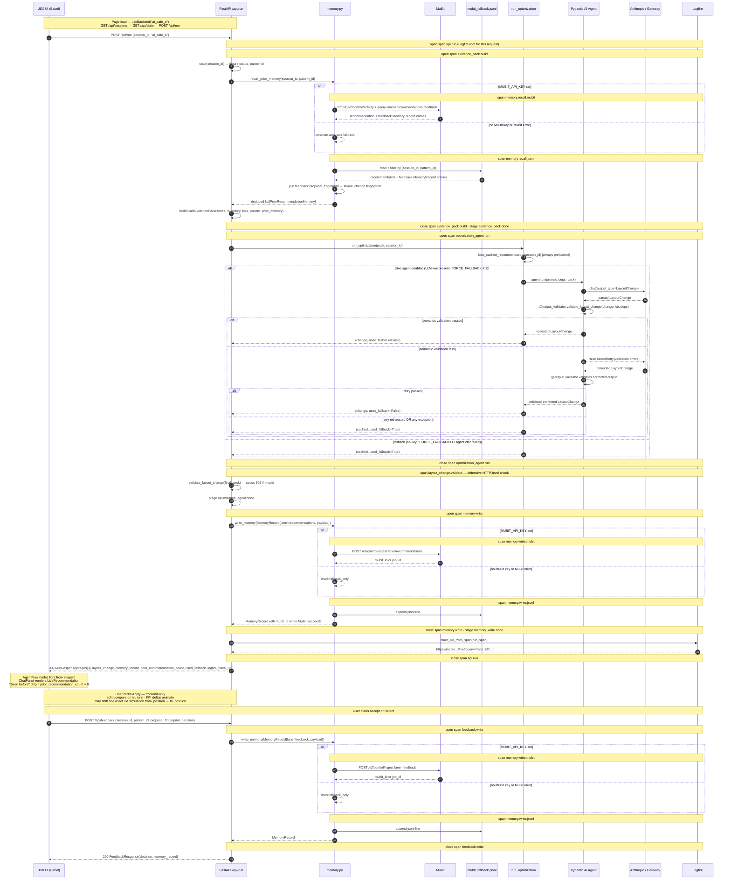

# CafeTwin / SimCafe — Engineering Plan

## Purpose

Detailed implementation plan for engineers. Aligns with `overview_plan.md`. Time horizon is **~18h**. Build philosophy is locked:

```
MVP    = real intelligence (two Pydantic AI agents in sequence: PatternAgent → OptimizationAgent), mocked spectacle (existing JSX demo)
Tier 1 = realer perception (live KPI engine, live YOLO/ByteTrack tracks)
Tier 2 = richer spectacle (SceneBuilderAgent, R3F twin, chat, scenario rail)
```

This document specifies **MVP** in full and gives upgrade contracts for Tier 1 / Tier 2. Anything not in MVP is a non-goal until MVP is green.

**Frontend strategy (locked):** the MVP keeps the existing `frontend/cafetwin.html` Babel-in-browser demo as the shell. We add a thin `frontend/api.js` and a `useBackend()` hook in `app-state.jsx`; existing components (`AgentFlow`, `ChatPanel`, `TopBar`, `ScenarioRail`) gain optional props that bind real backend data. No Vite port. The demo's hand-authored scenarios stay as decorative what-ifs; the agent contributes one chip (`recommended`) materialised from the real `LayoutChange`.

**The rule:** what is mock stays mock; what is real (or could be real with a small additive binding) gets wired in MVP. Tier 1 / Tier 2 add the rest. No existing JSX file is rewritten. The canonical real/mock inventory per UI surface lives in `overview_plan.md` §Frontend strategy → "What's real vs mock in the MVP UI"; this engineering plan should not duplicate it.

## Visual Architecture — module-level, per tier

Three views of the same system. Each tier strictly adds to the previous one — boxes marked `(NEW)` are the additions vs the prior tier. Tiers are gated on the previous tier being green and stable.

Legend: `[REAL]` = live code at demo time. `[mock]` = fixture or prebaked artifact. `(NEW)` = added in this tier.

### MVP — real intelligence, mocked spectacle

```text
  ── PERCEPTION (mocked) ───────────  ── INTELLIGENCE (REAL · one agent) ───  ── PRESENTATION (existing JSX) ──

  demo_data/                          app/                                     frontend/  (Babel-in-browser)
  ┌───────────────────────────┐       ┌──────────────────────────────────┐    ┌─────────────────────────────┐
  │ zones.json           [mock]│      │ evidence_pack.py          [REAL] │    │ cafetwin.html               │
  │ object_inventory.json[mock]│      │   build() → CafeEvidencePack     │    │ + api.js          (NEW)      │
  │ kpi_windows.json     [mock]│ ───▶ │   ↳ recall_decision_memory       │    │ + useBackend()    (NEW)      │
  │ pattern_fixture.json [mock]│      │                                  │    │                              │
  │ recommendation.cached[mock]│      │ agents/optimization_agent.py     │    │ TopBar (logfire URL wired)   │
  └────────────┬──────────────┘       │   Pydantic AI · Claude    [REAL] │──▶ │ AgentFlow (5 nodes ← stages) │
               │                      │   ↳ output_validator + retry     │    │ KPI cards (kpi_windows)      │
               │                      │   ↳ fallback to cached           │    │ ChatPanel ToolCall renders   │
               │                      │                                  │    │   real LayoutChange + Apply  │
               │                      │ memory.py                 [REAL] │    │ ScenarioRail: synthesized    │
               │                      │   write_memory() raw events       │    │   presets + recommended chip │
               │                      │   recall_memory_view()            │    │   (built from LayoutChange)  │
               │                      └────────┬───────────┴──┬──────────┘    │ Iso twin (cafe-iso.jsx)      │
               │                               │              │               │   split-compare on Apply,    │
               │                               ▼              ▼               │   optionally shifts target   │
               │                      ┌──────────────┐  ┌──────────────────┐  │   asset by simulation.delta  │
               │                      │ MuBit        │  │ mubit_fallback   │  │ Memories modal (NEW)         │
               │                      │  (primary)   │  │  .jsonl          │  └─────────────▲───────────────┘
               │                      └──────┬───────┘  └─────────┬────────┘                │
               │                             │                    │                         │
               │                             └─────────┬──────────┘  /api/memories          │
               │                                       ▼              ───────────────────────
               │                            ┌──────────────────────┐
               └───────────────────────────▶│ Logfire   one trace  │
                                            │ /api/run:    4 spans │
                                            │ /api/feedback: 1 span│
                                            └──────────────────────┘

  Routes: GET /api/sessions, GET /api/state, POST /api/run, POST /api/feedback,
          GET /api/memories, GET /api/logfire_url
```

### Tier 1 — realer perception (only if MVP green)

Perception layer becomes live. Intelligence and presentation layers untouched. **Adds 3 memory lanes and 3 Logfire spans.**

```text
  ── PERCEPTION (now REAL) ─────────  ── INTELLIGENCE (REAL, unchanged) ──   ── PRESENTATION (still mocked shell)

  ┌─────────────────────────────┐
  │ scripts/run_yolo_offline.py │     (same app/ as MVP)                    (same frontend/ as MVP)
  │   YOLO + ByteTrack    (NEW) │
  │   → tracks.cached.json[REAL]│ ─┐
  └─────────────────────────────┘  │
                                   │
  ┌─────────────────────────────┐  │  ┌────────────────────────────────┐
  │ scripts/render_annotated.py │  │  │ evidence_pack.py        [REAL] │
  │   ffmpeg overlays     (NEW) │  ├─▶│   build() → CafeEvidencePack   │
  │   → annotated_before.mp4    │  │  │                                │
  └─────────────────────────────┘  │  │ kpi_engine.py           (NEW)  │
                                   │  │   compute_window()      [REAL] │
  ┌─────────────────────────────┐  │  │   → list[KPIReport]            │
  │ zones.json (still hand-drawn,│ ─┤  │                                │
  │  no zone agent in any tier) │  │  │ agents/pattern_agent.py (NEW)  │
  └─────────────────────────────┘  │  │   Pydantic AI           [REAL] │
                                   │  │   → OperationalPattern         │
  ┌─────────────────────────────┐  │  │   (or deterministic builder)   │
  │ object_inventory.json [mock]│ ─┘  │                                │
  │  (manual review of YOLO)    │     │ agents/optimization_agent.py   │
  └─────────────────────────────┘     │   (unchanged)           [REAL] │
                                      └─────────────┬──────────────────┘
  pattern_fixture.json — REMOVED                    │
  (replaced by live PatternAgent)                   ▼
                                          ┌────────────────────┐
                                          │ memory.py  (NEW writes:
                                          │   kpi · inventory · pattern)
                                          │   on top of MVP writes
                                          └─────┬──────────┬───┘
                                                ▼          ▼
                                          MuBit (+ lanes:    jsonl
                                          location:demo:kpi
                                          location:demo:inventory
                                          location:demo:patterns)
                                                │
                                                ▼
                                         Logfire (NEW spans:
                                          kpi_engine.compute_window × N
                                          pattern_agent.run
                                          memory.write × 3)
```

### Tier 2 — richer spectacle (only if Tier 1 green)

Presentation layer upgrades. Backend gains a second agent. **Adds SceneBuilderAgent, /api/apply, optional R3F, activated chat.**

```text
─── PERCEPTION (Tier 1, REAL · unchanged) ──────────────────────────────────────

  tracks.cached.json [REAL] · kpi_windows (live engine) [REAL]
  zones.json [mock]          · object_inventory.json    [mock]
  pattern via PatternAgent (or deterministic builder)   [REAL]

─── INTELLIGENCE (Tier 1 + one new agent) ──────────────────────────────────────

  ┌────────────────────────────────────┐  ┌────────────────────────────────────┐
  │ optimization_agent.py       [REAL] │  │ scene_builder_agent.py     (NEW)   │
  │   (unchanged from MVP/Tier 1)      │  │   Pydantic AI · Claude     [REAL]  │
  │   → LayoutChange                   │  │   emits TwinLayout                 │
  └────────────────────────────────────┘  │   called twice per demo:           │
                                          │     mode=observed   ← inventory    │
                                          │    mode=recommended ← LayoutChange │
                                          │   ↳ retry + validate + cached      │
                                          └────────────────────────────────────┘

─── PRESENTATION (richer JSX shell, optionally Vite-ported) ────────────────────

  ┌────────────────────────────────────────────────────────────────────────────┐
  │ TopBar                          [REAL]  unchanged from MVP                 │
  │ Recommendation card             [REAL]  unchanged from MVP                 │
  │                                                                            │
  │ Flow canvas (7 nodes)           (NEW)   per-span animation from Logfire    │
  │ Twin panel                      (NEW)   R3F box prefabs ← reads TwinLayout │
  │                                          iso renderer = ?lowend=1 fallback │
  │ Scenario rail                   (NEW)   2–3 prebaked concept chips         │
  │                                          (each = one SceneBuilderAgent run)│
  │ Chat input                      (NEW)   activated, supported-prompts-only  │
  │ Memory timeline                 (NEW)   rich UI with previews              │
  │ Hyper3D hero asset (optional)   [mock]  one prebaked GLB if time permits   │
  └────────────────────────────────────────────────────────────────────────────┘

  Backend additions:
    POST /api/apply           SceneBuilderAgent → recommended TwinLayout
    GET  /api/twin/{scenario} (optional) parsed layout for scenario rail
    /api/chat                 (optional) routed supported prompts

  Sponsor integrations: none new.
```

### Cross-tier component status

| Component | MVP | Tier 1 | Tier 2 |
|---|---|---|---|
| `zones.json` | hand-drawn | hand-drawn (no zone agent ever) | hand-drawn |
| `tracks.cached.json` | hand-authored or skipped | live YOLO+ByteTrack offline (Tier 1B ✅) | same as Tier 1 |
| `kpi_windows.json` | precomputed numbers | live `app/vision/kpi.py` per request, gated on `source_kind=real` (Tier 1C ✅; AI-mock sessions keep narrative fixture) | same as Tier 1 |
| `pattern_fixture.json` | live `PatternAgent` (fixture is fallback) | unchanged | unchanged |
| `PatternAgent` | live Pydantic AI (`PatternEvidenceBundle → OperationalPattern`, normalized canonical `pattern.id`) | unchanged | unchanged |
| `OptimizationAgent` | live Pydantic AI | unchanged | unchanged |
| `SceneBuilderAgent` | **not in MVP** | not in Tier 1 | live Pydantic AI (2 calls) |
| MuBit lanes | recommendations, feedback | + kpi, inventory, patterns | same as Tier 1 |
| Frontend | existing `cafetwin.html` + JSX (Babel-in-browser) + new `api.js` | same as MVP | same JSX shell, optionally Vite/TS-ported once locked |
| Twin panel | existing iso renderer (`cafe-iso.jsx`), driven by demo presets + optional `simulation` shift | same as MVP | R3F box prefabs reading `TwinLayout`; iso = lowend fallback |
| Chat | input visible but disabled / hidden | same as MVP | input activated; supported-prompts-only |
| Scenario rail | demo presets + 1 agent-driven `recommended` chip | same as MVP | + 2–3 prebaked concept chips (each = one `SceneBuilderAgent` call) |
| Logfire span count | 5 on `/api/run` (`api.run`, `evidence_pack.build`, `pattern_agent.run` + nested Pydantic AI auto-spans, `optimization_agent.run` + nested, `memory.write`) + 1 on `/api/feedback` | 6 on `/api/run` (Tier 1C adds `kpi_engine.compute_window` inside `evidence_pack.build`) | + scene_builder spans on `/api/apply` |
| Routes | `/api/sessions`, `/api/state`, `/api/run`, `/api/feedback`, `/api/memories`, `/api/logfire_url` | same as MVP | + `/api/apply`, optional `/api/twin/{scenario}`, `/api/chat` |
| Sponsor services | Anthropic, MuBit, Logfire | + (none) | + (none) |

### Sponsor services used at demo time (all tiers)

- **Anthropic Claude** — drives `PatternAgent` and `OptimizationAgent` in MVP, sequenced on every `/api/run` call (`SceneBuilderAgent` in Tier 2). Both MVP agents fall back to their cached JSON fixtures on live failure so the demo never breaks.
- **MuBit** — durable raw event store for recommendations + feedback; recall builds a derived, decision-aware memory view so the agent sees accepted/rejected prior proposals. Degrades silently to jsonl when `MUBIT_API_KEY` unset.
- **Logfire** — auto-instruments Pydantic AI; manual spans for evidence pack build, KPI compute (Tier 1), validation, memory write, MuBit recall.
- **Render** — backend hosting via `render.yaml`; the Tier 1 blueprint pins `branch: tier_1` and provisions service `cafetwin-backend-tier1`. Build uses `uv sync --python 3.12 --frozen --no-dev --no-install-project` so dependency install does not trip setuptools flat-layout package discovery on `frontend/`, `demo_data/`, or `cafe_videos/`, and so `uv` uses Render's `PYTHON_VERSION=3.12` runtime instead of the local `.python-version` 3.13 pin.
- **Vercel** — static frontend hosting from `frontend/`; MVP and Tier 1 are separate projects/URLs. MVP stays on project `frontend` at `https://frontend-hazel-xi-17.vercel.app/cafetwin.html` with `/api/*` rewritten to `https://cafetwin-backend.onrender.com/api/*`; Tier 1 is project `frontend-tier1` at `https://frontend-tier1.vercel.app/cafetwin.html` with `/api/*` rewritten to `https://cafetwin-backend-tier1.onrender.com/api/*`. Passing `CAFETWIN_RENDER_URL` inline avoids reading/exporting local backend secrets into the Vercel CLI process.

### Judge-facing overview asset

- `docs/cafetwin-tier1-overview.html` is the editable 16:9 source for a judge-facing Tier 1 product overview. It renders the `real_cafe` frame with annotated-perception callouts, the typed PatternAgent -> OptimizationAgent pipeline, and the demo UI recommendation/memory/trace story.
- `docs/cafetwin-tier1-overview.png` is the generated 1600 x 900 deck/README-ready artifact.
- `README.md` and `docs/architecture/README.md` use a Mermaid Tier 1 architecture diagram instead of a generated architecture PNG/HTML. The diagram shows existing CCTV video files → offline perception → typed evidence → Pydantic AI agents → UI, memory, and Logfire.

## Sequence — `/api/run` and `/api/feedback`

What happens end-to-end when the demo loads and when the user clicks **Accept** / **Reject**. Every arrow is a real function call or network hop at demo time.

The diagram below captures the MVP memory target. `memory.py` treats MuBit +
jsonl as a durable raw event store, then derives a decision-aware view by
joining recommendation records with feedback records on the proposal
fingerprint. MuBit is attempted first when `MUBIT_API_KEY` is set; jsonl is
always mirrored so the demo survives a MuBit outage.



### Mapping: sequence steps → Logfire spans (current code)

`/api/run` produces this nested tree under the root `api.run` span:

| Concern | Span (parent → children) |
|---|---|
| Evidence + recall | `evidence_pack.build` → `memory.recall.mubit` when configured, then `memory.recall.jsonl` |
| Recommendation | `optimization_agent.run` (wraps `run_optimization`; nested pydantic-ai auto-spans appear when `instrument_pydantic_ai()` is active) |
| Validate (HTTP check) | `layout_change.validate` |
| Memory write | `memory.write` → `memory.write.mubit` when configured, then `memory.write.jsonl` |

`/api/feedback`:

| Concern | Span (parent → children) |
|---|---|
| Feedback write | `feedback.write` → `memory.write.mubit` when configured, then `memory.write.jsonl` |

MVP `pattern_agent.run` lives in the trace too — it's a real Pydantic AI span auto-instrumented by `instrument_pydantic_ai()`, sandwiched between `evidence_pack.build` and `optimization_agent.run`.

Tier 1 / Tier 2 add-ons:

- `kpi_engine.compute_window` (Tier 1C ✅ landed; one span inside
  `evidence_pack.build`, fired only when live KPIs engage — see
  `app/vision/kpi.py`). Replaces precomputed `kpi_windows.json` numbers
  for `source_kind=real` sessions while preserving the fixture window
  schedule + memory_ids so `PatternAgent` evidence citations stay valid.
- Live `tracks.cached.json` from YOLO/ByteTrack offline (Tier 1B ✅ landed
  via `app/vision/tracks.py` + `scripts/run_yolo_offline.py`).
- `scene_builder_agent.run` × 2 (Tier 2, on `/api/apply`) producing observed
  + recommended `TwinLayout`s.

### Frontend stage timestamps → flow canvas nodes

`RunResponse.stages[]` carries 4 entries: `evidence_pack`, `pattern_agent`, `optimization_agent`, `memory_write`. The existing demo's [AgentFlow](frontend/app-panels.jsx) shows 5 visual nodes. Map them as:

| Visual node (in `app-panels.jsx`) | Driven by `StageTiming.name` | What lights up |
|---|---|---|
| `vision` | `evidence_pack` | Object inventory + zones loaded into the pack |
| `kpi` | `evidence_pack` | KPI windows loaded into the pack |
| `pattern` | `pattern_agent` | Live PatternAgent emits `OperationalPattern` (or fixture fallback) |
| `optimize` | `optimization_agent` | OptimizationAgent + validate + retry/fallback |
| `simulate` (relabel to `memory` for honesty) | `memory_write` | MuBit + jsonl write |

All five light up sequentially on the single `/api/run` call. Latency badges on each node read `ended_at - started_at` for that stage; the two `evidence_pack`-driven nodes (vision/kpi) share a latency or split it visually. The `pattern` node is now driven by its own `pattern_agent` stage so the timing is honest. In Tier 2, `SceneBuilderAgent` adds two stages (`scene_build.observed` and `scene_build.recommended`) which can populate `simulate` (renamed `scene`) honestly.

## Demo loop (MVP)

```
fixtures (loaded once per session selection)
  ↓
GET /api/sessions ─────────────────────────────────
  list of SessionManifest (ai_cafe_a + any authored alternates)
  ↓
GET /api/state?session_id=ai_cafe_a ───────────────
  fixture status + KPI windows + zones + object inventory + pattern
  ↓
POST /api/run {session_id: ai_cafe_a} ─────────────
  build_pattern_evidence_bundle(state)      (zones + inventory + KPIs)
  ↓
  run_pattern_detection                     (PatternAgent: Pydantic AI output_validator
                                            + ModelRetry; cached pattern fixture fallback;
                                            pattern.id normalized to canonical for stable recall)
  ↓
  recall_prior_memory(session_id, pattern.id)      (MuBit when configured + jsonl fallback)
  ↓
  join recommendations + feedback into decision-aware prior memory
  ↓
  build CafeEvidencePack(session_id, prior_recommendation_memories=..., pattern=...)   (typed input bundle)
  ↓
  run_optimization                          (OptimizationAgent: Pydantic AI output_validator
                                            + ModelRetry; cached recommendation fallback)
  ↓
  validate_layout_change (defensive HTTP check) → 502 if still invalid
  ↓
  memory.write (lane=recommendations)       (MuBit primary + jsonl mirror)
  ↓
  UI binds RunResponse: AgentFlow nodes light from stages[]; ChatPanel ToolCall
  renders the real LayoutChange; ScenarioRail materialises a `recommended` chip;
  TopBar Logfire link uses logfire_trace_url; "Seen before" chip if
  prior_recommendation_count > 0, with accepted/rejected memory available
  to the agent prompt
  ↓
user clicks Apply (or selects the recommended chip)
  ↓
  Frontend-only: iso twin enters split-compare; KPI delta cards on the
  recommended chip animate from LayoutChange.expected_kpi_delta;
  optionally one asset visibly shifts using simulation.from_position/to_position
  ↓
user clicks Accept / Reject
  ↓
POST /api/feedback ─────────────────────────────────
  memory.write (lane=feedback)              (MuBit primary + jsonl mirror)
  ↓
  UI: toast confirms; Memories modal (next open) shows the new entry
  with a mubit_id chip when MuBit succeeds
```

One Logfire trace per `/api/run`, root span `api.run` with this nested tree:

1. `evidence_pack.build` (loads perception fixtures + builds `PatternEvidenceBundle`)
2. `pattern_agent.run` (PatternAgent — Pydantic AI auto-spans for the model call when `instrument_pydantic_ai()` is active)
3. `memory.recall.mubit` when configured, then `memory.recall.jsonl` (now scoped to the pattern_id picked by PatternAgent)
4. `optimization_agent.run` (OptimizationAgent — Pydantic AI auto-spans likewise)
5. `layout_change.validate`
6. `memory.write` (+ child `memory.write.mubit` when configured, then `memory.write.jsonl`)

Plus a smaller `/api/feedback` trace:

5. `feedback.write` (+ child `memory.write.mubit` when configured, then `memory.write.jsonl`)

## File layout

```
app/
  schemas.py                    # all Pydantic models — implemented; SessionManifest to add
  evidence_pack.py              # build(session_id, pattern=...) → CafeEvidencePack;
                                # build_pattern_evidence_bundle(state) → PatternEvidenceBundle
  agents/
    pattern_agent.py            # live Pydantic AI agent → OperationalPattern (canonical id-normalized)
    optimization_agent.py       # live Pydantic AI agent → LayoutChange
    # scene_builder_agent.py    # Tier 2 only
  memory.py                     # MuBit/jsonl raw event store + derived recall view
  logfire_setup.py              # init + span helpers
  api/
    main.py                     # FastAPI app + CORSMiddleware
    routes.py                   # /api/sessions, /api/state, /api/run, /api/feedback, /api/memories, /api/logfire_url
  fallback.py                   # load sessions/<id>/recommendation.cached.json when the agent fails
  config.py                     # env vars, demo_data path
  sessions.py                   # discover sessions/<slug>/, parse SessionManifest, validate fixture presence
cafe_videos/                    # three CCTV source videos (already in repo)
  real_cctv.mp4
  ai_generated_cctv.mp4
  ai_generated_cctv_round.mp4
demo_data/
  sessions/
    ai_cafe_a/                  # MVP mock — must ship
      session.json
      zones.json
      object_inventory.json
      kpi_windows.json
      pattern_fixture.json
      recommendation.cached.json
    real_cafe/                  # Tier 1A real-video fixture pack on real_cctv.mp4
      session.json
      frame.jpg
      tracks.cached.json        # Tier 1B — YOLOv8n + ByteTrack person tracks
      annotated_before.mp4      # Tier 1B — overlay video for pitch/debugging
      object_detections.cached.json  # Tier 1B — YOLOv8x static furniture/layout detections
      object_review.cached.json      # Tier 1B — Pydantic AI object-review keep/drop decisions
      object_detections.reviewed.cached.json  # Tier 1B — reviewed detector candidates
      zones.json
      object_inventory.json
      kpi_windows.json
      pattern_fixture.json
      recommendation.cached.json
  mubit_fallback.jsonl          # shared across sessions, payloads include session_id
frontend/                       # existing Babel-in-browser demo — bind backend, do not rewrite
  cafetwin.html                 # shell (already built; ?session=real_cafe URL selector)
  app-state.jsx                 # add useBackend(sessionId) + scenarioFromLayoutChange()
  app-canvas.jsx                # iso twin canvas + split-compare (already built)
  app-panels.jsx                # TopBar, AgentFlow, ChatPanel, ScenarioRail (bind backend props)
  cafe-iso.jsx                  # SVG iso renderer (already built)
  tweaks-panel.jsx              # editable tweaks panel (already built; gains session select)
  cafetwin.css                  # 32KB stylesheet (already built)
  api.js                        # NEW: fetch wrappers — listSessions, getState, postRun, postFeedback, getMemories, getLogfireUrl
models/                         # gitignored local model cache
  ultralytics/                  # active YOLO .pt weights used by vision scripts
images/                         # gitignored generated screenshots / annotated still images
scripts/
  setup.sh / dev.sh             # local bootstrap and backend+frontend dev loop
  test.sh / smoke.sh            # pytest+ruff and running-backend shape smoke test
  deploy_render.sh / deploy_vercel.sh  # hosted backend/frontend deployment helpers; Vercel helper rewrites to the Tier 1 Render backend
  run_yolo_offline.py           # Tier 1B: produce tracks.cached.json + annotated_before.mp4
  detect_layout_objects.py      # Tier 1B: produce object_detections.cached.json static layout cache
  review_layout_objects_agent.py      # Tier 1B: Pydantic AI reviewer -> reviewed object cache
  transcode_annotated_for_web.sh      # Tier 1D: H.264 transcode for browser video
```

Current status (2026-04-26): `pyproject.toml`, `app/`, `app/api/`,
`app/agents/`, `demo_data/`, `frontend/`, `scripts/`, and
`docs/architecture/` exist. `app/schemas.py` is implemented with strict
Pydantic models for fixtures, `CafeEvidencePack`, `LayoutChange`, memory
records, API responses, and Tier 2 twin layouts. `demo_data/sessions/ai_cafe_a/`
now contains the extracted 5s frame and all six required JSON fixtures.
`demo_data/sessions/real_cafe/` now contains a Tier 1A real-video fixture pack
derived from the 20s frame of `cafe_videos/real_cctv.mp4`; full YOLO/ByteTrack
person perception lands as Tier 1B via `app/vision/tracks.py` and
`scripts/run_yolo_offline.py`, producing `tracks.cached.json` and
`annotated_before.mp4` for `real_cafe`. Static layout perception is a separate
Tier 1B lane via `app/vision/objects.py` and `scripts/detect_layout_objects.py`:
the script runs high-accuracy YOLOv8x over the representative frame plus sampled
video frames, aggregates duplicate furniture detections, and writes
`object_detections.cached.json` for both `ai_cafe_a` and `real_cafe`.
Archived benchmark results in `docs/vision_benchmarks.md` compare YOLOv8x,
RT-DETR-x, YOLO11x, local Moondream Photon/Kestrel, and the legacy Moondream
0.5B `.mf` ONNX artifacts. RT-DETR-x is higher-recall but visibly noisier, so
the base cache stays YOLOv8x while the Pydantic AI `ObjectReviewAgent` writes
stricter `object_detections.reviewed.cached.json` caches from detector
candidates. The optional Moondream generator was pruned after its benchmark
results were archived because it is not part of the stable demo path. Heavy
local artifacts are organized under ignored folders: `models/ultralytics/` for
active YOLO `.pt` weights and `images/` for generated screenshots plus
annotated still images; benchmark/prototype-only scripts and weights were
removed after archiving the results.
`app/evidence_pack.py`, `app/sessions.py`, `app/fallback.py`, `app/memory.py`,
and `app/api/routes.py` provide the first test-backed backend spine for the six
MVP routes. `OptimizationAgent` now uses Pydantic AI `@output_validator` +
`ModelRetry` for semantic validation failures before using the cached
recommendation, and `/api/memories?session_id=...`
filters local jsonl records server-side by `payload.session_id`. `tests/`
covers the fixture contract, route response models, agent semantic retry, and
memory filtering (`pytest` 10 passed; `ruff check app tests` passed). `.agents/`
is local-only coordination/skills state and is ignored; `.agents/handoff.md`
should be read and updated during multi-agent work but not committed.

Next implementation step: bind the existing Babel-in-browser frontend to these
route shapes while tightening MuBit and Logfire behavior behind the
already-working fallback path.

## Demo data contract (MVP fixtures)

CCTV videos in `cafe_videos/` seed sessions. Each session is a self-contained fixture pack hand-derived from a representative frame of its source video.

### Sessions

| Session slug | Source video | Status |
|---|---|---|
| `ai_cafe_a` | `cafe_videos/ai_generated_cctv.mp4` (1924×1076 / 24fps / 15s) | **MVP + Tier 1B primary vision demo.** Controlled AI-generated CCTV mock; YOLOv8n + ByteTrack now produces the cleanest `tracks.cached.json` + `annotated_before.mp4` for pitch screenshots and KPI-engine work. |
| `real_cafe` | `cafe_videos/real_cctv.mp4` (1280×720 / 30fps / 49s) | **Tier 1A/B landed.** Manual real-video fixture pack is authored, and YOLOv8n + ByteTrack also produces `tracks.cached.json` + `annotated_before.mp4`; detections are noisier than the fake session. |

`cafe_videos/ai_generated_cctv_round.mp4` is held in repo as raw material; no session is authored against it for MVP or Tier 1.

### Per-session files

For each `<slug>` under `demo_data/sessions/<slug>/`:

| File | Schema | Notes |
|---|---|---|
| `session.json` | `SessionManifest` (new schema, see below) | Slug, label, video relative path, source kind (`real` or `ai_generated`), notes. |
| `zones.json` | `list[Zone]` | Hand-drawn polygons traced from the representative frame. Loaded into `CafeEvidencePack`. |
| `object_inventory.json` | `ObjectInventory` | Hand-authored counts + `center_xy` in the video's pixel coordinate space. Loaded into `CafeEvidencePack`. |
| `kpi_windows.json` | `list[KPIReport]` | 3–4 precomputed windows with plausible numbers consistent with the visible activity. The pattern fixture's `evidence_ids` cite these windows' `memory_id`. |
| `pattern_fixture.json` | `OperationalPattern` | One pattern. The agent **must** cite its `evidence[*].memory_id` values. |
| `recommendation.cached.json` | `LayoutChange` | Deterministic fallback used if the agent retries fail validation for this session. |
| `frame.jpg` (optional) | image | The representative frame used to derive the fixtures. Pulled with `ffmpeg -ss 5 -i <video> -frames:v 1 frame.jpg`. Useful for debugging / regenerating fixtures. |

### Global files

| File | Schema | Notes |
|---|---|---|
| `cafe_videos/real_cctv.mp4`, `ai_generated_cctv.mp4`, `ai_generated_cctv_round.mp4` | binary | Already in repo. Not parsed by backend at runtime. Optionally streamed by the frontend if the canvas's `view` segment grows a `video` mode. |
| `demo_data/sessions/<slug>/tracks.cached.json` | `TracksCache` (`app/vision/tracks.py`) | Tier 1 only — produced offline by `scripts/run_yolo_offline.py --session <slug>`. Contains anonymized person `track_id`s, bboxes, centers, zone IDs, and heuristic roles (`staff` / `customer` / `unknown`). Not used in MVP. |
| `demo_data/sessions/<slug>/twin_observed.json` / `twin_recommended.json` | `TwinLayout` (Tier 2 schema) | Tier 2 R3F input. Not used in MVP — the iso renderer synthesises its scene from demo presets. |
| `demo_data/mubit_fallback.jsonl` | append-only | Created at runtime. Shared across sessions. Each record's payload includes `session_id` so the Memories modal can filter. |

### `SessionManifest` schema

Add to `app/schemas.py`:

```python
class SessionManifest(StrictModel):
    slug: str                              # e.g. "ai_cafe_a"
    label: str                             # human-readable, e.g. "AI cafe A (mock CCTV)"
    video_path: str                        # relative path, e.g. "cafe_videos/ai_generated_cctv.mp4"
    source_kind: Literal["real", "ai_generated"]
    notes: str | None = None
    representative_frame_idx: int | None = None
```

`evidence_pack.build(session_id)` resolves files under `demo_data/sessions/<session_id>/`. If `session_id` is unset, defaults to `"ai_cafe_a"`. Missing files → `/api/state` returns a clear error (no silent fallback to a different session).

**Failure rule:** if any required fixture for the active session is missing at startup, `/api/state?session_id=...` returns a clear error with the missing filename. Don't paper over it or silently fall back to another session.

## Schemas

```python
from datetime import datetime
from typing import Literal
from uuid import UUID, uuid4

from pydantic import BaseModel, Field

# ---------- Vision-shaped (used as fixture inputs in MVP) ----------

ObjectKind = Literal[
    "table", "chair", "counter", "pickup_shelf",
    "queue_marker", "menu_board", "plant", "barrier",
]


class SceneObject(BaseModel):
    id: str
    kind: ObjectKind
    label: str
    bbox_xyxy: tuple[float, float, float, float]
    center_xy: tuple[float, float]
    size_xy: tuple[float, float]
    rotation_degrees: float = 0
    zone_id: str | None = None
    movable: bool = True
    confidence: float
    source: Literal["vision", "manual", "fixture"] = "fixture"


class ObjectInventory(BaseModel):
    session_id: str           # slug, e.g. "ai_cafe_a"
    run_id: UUID
    source_frame_idx: int
    source_timestamp_s: float
    objects: list[SceneObject]
    counts_by_kind: dict[ObjectKind, int]
    count_confidence: float
    notes: list[str] = Field(default_factory=list)


class TrackPoint(BaseModel):
    track_id: int
    role: Literal["staff", "customer", "unknown"] = "unknown"
    timestamp_s: float
    x: float
    y: float
    zone_id: str | None = None


class Zone(BaseModel):
    id: str
    name: str
    kind: Literal["counter", "queue", "pickup", "seating", "staff_path", "entrance"]
    polygon: list[tuple[float, float]]
    color_hex: str = "#64748b"
    source: Literal["agent_drafted", "manual", "fixture"] = "fixture"
    confidence: float | None = None


# ---------- KPI ----------

KPIField = Literal[
    "staff_walk_distance_px",
    "staff_customer_crossings",
    "queue_obstruction_seconds",
    "congestion_score",
    "table_detour_score",
]


class KPIReport(BaseModel):
    window_start_s: float
    window_end_s: float
    frames_sampled: int
    staff_walk_distance_px: float
    staff_customer_crossings: int
    queue_length_peak: int
    queue_obstruction_seconds: float
    congestion_score: float
    table_detour_score: float
    session_id: str           # slug, e.g. "ai_cafe_a"
    run_id: UUID
    memory_id: str  # e.g. "mem_kpi_w1"; cited by patterns


# ---------- Pattern (fixture in MVP, agent in Tier 1) ----------

class EvidenceRef(BaseModel):
    memory_id: str
    lane: str
    summary: str
    kpi_field: KPIField | None = None


class OperationalPattern(BaseModel):
    id: str  # e.g. "pat_queue_crossing_001"
    title: str
    summary: str
    pattern_type: Literal[
        "queue_crossing", "staff_detour", "table_blockage", "pickup_congestion"
    ]
    evidence: list[EvidenceRef] = Field(min_length=1)
    severity: Literal["low", "medium", "high"]
    affected_zones: list[str]


# ---------- Derived memory view for agent input ----------

class PriorRecommendationMemory(BaseModel):
    """Decision-aware memory derived from raw recommendation + feedback events.

    MuBit/jsonl store the raw events. `memory.py` joins feedback by
    `proposal_fingerprint == layout_change.fingerprint` before the agent sees
    it, so the optimizer learns from accepted/rejected proposals rather than
    merely seeing an append-only audit log.
    """
    session_id: str
    pattern_id: str
    fingerprint: str
    title: str
    target_id: str
    layout_change: "LayoutChange"
    decision: Literal["accept", "reject", "unknown"] = "unknown"
    reason: str | None = None
    last_seen_at: datetime
    source: Literal["mubit", "jsonl", "merged"]


# ---------- Agent input bundle ----------

class CafeEvidencePack(BaseModel):
    """Single typed input to OptimizationAgent.
    Built by `evidence_pack.build(session_id)` from demo_data fixtures (MVP)
    or live KPI engine output (Tier 1).
    """
    session_id: str                                # slug, e.g. "ai_cafe_a"
    run_id: UUID = Field(default_factory=uuid4)
    zones: list[Zone]
    object_inventory: ObjectInventory
    kpi_windows: list[KPIReport]
    pattern: OperationalPattern  # MVP: the fixture pattern. Tier 1: PatternAgent output.
    org_rules: list[str] = Field(default_factory=list)
    prior_recommendation_memories: list[PriorRecommendationMemory] = Field(default_factory=list)
    # Populated by recall_prior_memory(session_id, pattern_id). Empty list if
    # MuBit/jsonl have no prior runs. Recall is scoped to (session_id,
    # pattern_id) so cafes never see each other's recommendations. Each entry
    # carries accept/reject/unknown feedback derived from raw MemoryRecords.


# ---------- Agent output ----------

class LayoutSimulation(BaseModel):
    """Single-action MVP simulation spec. Renamed from `SimulationSpec` to
    avoid collision with the Tier-2 multi-op `SimulationSpec` in the UI spec
    (§3.5 of `docs/superpowers/specs/2026-04-25-simcafe-ui-design.md`).
    """
    action: Literal["move_table", "move_chair", "move_station", "change_queue_boundary"]
    target_id: str
    from_position: tuple[float, float]
    to_position: tuple[float, float]
    rotation_degrees: float = 0


class LayoutChange(BaseModel):
    """Pure agent output — does NOT carry session_id / pattern_id. The
    orchestrator wraps it in `RecommendationMemoryPayload` (below) when
    persisting, so recall scoping stays out of the LLM's schema.
    """
    title: str
    rationale: str
    target_id: str
    simulation: LayoutSimulation
    evidence_ids: list[str] = Field(min_length=1)  # MUST be subset of pattern.evidence ids
    expected_kpi_delta: dict[KPIField, float] = Field(min_length=1)
    confidence: float = Field(ge=0.0, le=1.0)
    risk: Literal["low", "medium", "high"]
    fingerprint: str


# ---------- Memory write payloads ----------

class RecommendationMemoryPayload(BaseModel):
    """Wraps a `LayoutChange` with the scoping fields needed by recall.
    Stored as `MemoryRecord.payload` for lane=recommendations.
    """
    session_id: str          # slug, e.g. "ai_cafe_a" — recall filters on this
    pattern_id: str          # the OperationalPattern.id this proposal addresses
    layout_change: LayoutChange


class FeedbackMemoryPayload(BaseModel):
    """Stored as `MemoryRecord.payload` for lane=feedback."""
    session_id: str
    pattern_id: str
    proposal_fingerprint: str
    decision: Literal["accept", "reject"]


class MemoryRecord(BaseModel):
    lane: Literal[
        "location:demo:recommendations",
        "location:demo:feedback",
        # Tier 1 lanes:
        "location:demo:kpi",
        "location:demo:inventory",
        "location:demo:patterns",
    ]
    intent: Literal["fact", "lesson", "feedback", "rule", "trace"]
    payload: dict           # validated via the per-lane payload models above
    written_at: datetime
    mubit_id: str | None = None
    fallback_only: bool = False
```

Notes:

- `LayoutChange` stays a pure agent-output type; `session_id` / `pattern_id` ride on the `RecommendationMemoryPayload` wrapper, so the LLM never has to copy them and recall stays correctly scoped.
- `PriorRecommendationMemory` is not a raw write payload. It is the derived recall view built by joining recommendation and feedback records. This is the object the optimizer should reason over for "accepted before" / "rejected before" behavior.
- `evidence_ids` is a flat `list[str]` rather than `list[EvidenceRef]` to make the Pydantic AI prompt simpler and semantic validation trivial.
- `expected_kpi_delta` keys are typed via `KPIField` literal, so the agent cannot hallucinate field names.
- `confidence` is bounded `[0,1]` by `Field`.

## OptimizationAgent (live, MVP)

**Input:** `CafeEvidencePack`. **Output:** `LayoutChange`.

### Pydantic AI setup

```python
import os
from pydantic_ai import Agent, ModelRetry, RunContext
from app.schemas import CafeEvidencePack, LayoutChange

optimization_agent: Agent[CafeEvidencePack, LayoutChange] | None = Agent(
    _agent_model_spec(),  # defaults to gateway/anthropic:claude-sonnet-4-6 when Gateway key exists
    deps_type=CafeEvidencePack,
    output_type=LayoutChange,
    instructions=OPTIMIZATION_INSTRUCTIONS,
    retries=1,         # request/tool level retry budget
    output_retries=1,  # semantic LayoutChange retry via output_validator
    defer_model_check=True,  # tests/imports work when live provider keys are absent
)


@optimization_agent.output_validator
async def validate_agent_output(
    ctx: RunContext[CafeEvidencePack],
    output: LayoutChange,
) -> LayoutChange:
    errors = validate_layout_change(output, ctx.deps)
    if errors:
        raise ModelRetry("Fix these LayoutChange validation errors:\n- " + "\n- ".join(errors))
    return output
```

`CAFETWIN_OPTIMIZATION_MODEL` stays overrideable for demo tuning. Per the
Pydantic AI Gateway docs, the Gateway string form is
`gateway/<api_format>:<model_name>`, e.g.
`gateway/anthropic:claude-sonnet-4-6`. If the Pydantic/Logfire org uses a custom
provider/routing-group name, set `PYDANTIC_AI_GATEWAY_ROUTE` or
`CAFETWIN_GATEWAY_ROUTE`; the backend will build an explicit Gateway provider
with `gateway_provider("anthropic", route=...)`.

### System prompt (contract)

```text
You are a cafe layout optimization agent. You receive a CafeEvidencePack
describing zones, an object inventory, KPI windows, and one OperationalPattern
identifying a spatial bottleneck. Your job is to emit a single typed
LayoutChange that addresses the pattern.

HARD RULES — you will be rejected if you violate any of these:

1. evidence_ids MUST be a non-empty subset of the memory_ids appearing in
   the input pattern.evidence[*].memory_id. Do not invent IDs.
2. expected_kpi_delta MUST contain at least one key from this set:
   {staff_walk_distance_px, staff_customer_crossings,
    queue_obstruction_seconds, congestion_score, table_detour_score}.
   Values are signed floats representing expected change (negative = improvement
   for distance/crossings/obstruction/congestion; lower table_detour_score is also
   better).
3. simulation.target_id MUST refer to an existing object in
   object_inventory.objects[*].id, or a zone id from zones[*].id for
   change_queue_boundary actions.
4. simulation.from_position MUST equal the current center_xy of that object
   (within 1px tolerance) when target is movable furniture.
5. confidence MUST be in [0.0, 1.0] and risk MUST be one of {low, medium, high}.
6. fingerprint MUST be a short stable hash-like string of (target_id, action,
   to_position) so duplicates can be detected.

Prefer ONE high-confidence move. Keep rationale to 2-3 sentences citing the
specific pattern. Do not propose multiple changes.

Use prior_recommendation_memories as decision-aware memory:

- If a prior recommendation was accepted and the current evidence is still
  compatible, prefer a compatible move or explicitly adapt it.
- If a prior recommendation was rejected, do not repeat the same
  fingerprint/target unless you explain what changed in the evidence.
- If prior memory exists, briefly acknowledge it in the rationale (e.g.
  "Adapts a previously accepted pickup-lane change" or "Avoids the rejected
  table_center_1 move"). If empty, do not mention prior memory.
```

### Pydantic AI output validation + fallback

Pydantic AI validates the raw JSON/schema shape via `output_type=LayoutChange`.
CafeTwin's evidence-aware semantic checks run inside an `@agent.output_validator`.
When those checks fail, the validator raises `ModelRetry`, so the same Pydantic
AI run asks the model for one corrected `LayoutChange` with the validation
errors. The API still runs a final defensive `layout_change.validate` span before
returning to the UI.

```python
def validate_layout_change(change: LayoutChange, pack: CafeEvidencePack) -> list[str]:
    pattern_ids = {ref.memory_id for ref in pack.pattern.evidence}
    errors = []
    if not change.evidence_ids:
        errors.append("missing evidence_ids")
    if not set(change.evidence_ids).issubset(pattern_ids):
        errors.append("evidence_ids outside pattern evidence")
    if not change.expected_kpi_delta:
        errors.append("missing expected_kpi_delta")
    object_ids = {o.id for o in pack.object_inventory.objects}
    if change.simulation.target_id not in object_ids:
        errors.append("simulation target not in inventory")
    return errors


async def run_optimization(pack: CafeEvidencePack, session_id: str) -> tuple[LayoutChange, bool]:
    """Returns (layout_change, used_fallback)."""
    with logfire.span("optimization_agent.run", session_id=pack.session_id):
        try:
            result = await optimization_agent.run(_optimization_prompt(pack), deps=pack)
            return result.output, False
        except Exception as e:
            logfire.warn("optimization_agent failed", error=str(e))
            return load_cached_recommendation(session_id), True
```

`load_cached_recommendation(session_id)` reads `demo_data/sessions/<session_id>/recommendation.cached.json` and returns it parsed as `LayoutChange`. Each session ships its own cached fallback that must satisfy `validate_layout_change` against that session's fixture pack — see §Acceptance checks.

## Memory layer

MuBit is the **primary** durable memory store in MVP when `MUBIT_API_KEY` is set. The local jsonl is a hot fallback that is always written so a MuBit outage at demo time degrades gracefully (no demo break). Conceptually, MuBit + jsonl are the **raw event store**: every recommendation and every Accept/Reject click is preserved as a `MemoryRecord`. The optimizer should not consume those raw events directly; `memory.py` builds a derived `PriorRecommendationMemory` view by joining feedback records to recommendation records by fingerprint.

```python
# app/memory.py
async def write_memory(record: MemoryRecord) -> MemoryRecord:
    # 1) MuBit primary via POST /v2/control/ingest when MUBIT_API_KEY is set.
    #    _mubit_remember embeds the full MemoryRecord JSON in text + metadata,
    #    returns a MuBit id or ingest job_id, and polls briefly for durability.
    if _mubit_available():
        with span("memory.write.mubit", lane=record.lane):
            mubit_id = await _best_effort_mubit_remember(record)
            if mubit_id:
                record = record.model_copy(update={"mubit_id": mubit_id, "fallback_only": False})

    # 2) Local jsonl mirror is unconditional.
    with span("memory.write.jsonl", lane=record.lane):
        append_jsonl(record)
    return record


async def recall_prior_memory(
    session_id: str,
    pattern_id: str,
    limit: int = 3,
) -> list[PriorRecommendationMemory]:
    """Recall decision-aware prior recommendations for this session+pattern.

    Reads recommendation + feedback raw events from MuBit first, then jsonl,
    joins feedback.proposal_fingerprint to layout_change.fingerprint, and
    returns a deduped view that carries decision=accept/reject/unknown.
    """
    raw_records = []
    if _mubit_available():
        with span("memory.recall.mubit", session_id=session_id, pattern_id=pattern_id):
            raw_records.extend(await _best_effort_mubit_query(...))
    with span("memory.recall.jsonl", session_id=session_id, pattern_id=pattern_id):
        raw_records.extend(read_jsonl_records(...))
    return build_prior_memory_view(raw_records, session_id, pattern_id)[:limit]
```

If `MUBIT_API_KEY` is unset, `_mubit_remember` / `_mubit_query` are skipped cleanly: writes still hit jsonl, recalls read jsonl only, and the demo still works. This is what `MemoryRecord.fallback_only` flags.

### Raw event store vs derived memory view

The raw records are useful for auditability and `/api/memories`; the derived view is what makes memory meaningful to the agent.

```text
lane=recommendations:
  payload.layout_change.fingerprint = ai_cafe_a_open_pickup_lane_v1

lane=feedback:
  payload.proposal_fingerprint = ai_cafe_a_open_pickup_lane_v1
  payload.decision = accept

derived PriorRecommendationMemory:
  fingerprint = ai_cafe_a_open_pickup_lane_v1
  decision = accept
  layout_change = <original LayoutChange>
```

This keeps MuBit usage simple and durable while avoiding the weak pattern of feeding the agent an append-only list with no outcome semantics.

### MVP writes

- After successful recommendation: one `MemoryRecord` on lane `location:demo:recommendations`, intent `lesson`, with `payload = RecommendationMemoryPayload(session_id, pattern_id, layout_change).model_dump()`. The `session_id` + `pattern_id` are read from the `CafeEvidencePack`, not from the LLM output.
- After Accept/Reject feedback: one `MemoryRecord` on lane `location:demo:feedback`, intent `feedback`, with `payload = FeedbackMemoryPayload(session_id, pattern_id, proposal_fingerprint, decision).model_dump()`.
- MuBit text content should be human-readable first and exact JSON second: a short summary (`Session`, `Pattern`, `Recommendation`, `Expected impact`, `Decision`) followed by `CAFETWIN_MEMORY_RECORD_JSON=...`. This improves semantic recall while preserving robust parsing.

### MVP reads

- `/api/run` loads fixture state to get `pattern.id`, calls `recall_prior_memory(session_id, pattern.id)`, then passes the derived prior memory into `evidence_pack.build(..., prior_recommendation_memories=...)`.
- `GET /api/memories?session_id=...` queries MuBit activity scoped by `session_id`, filters parsed `MemoryRecord.payload.session_id` client-side, and merges with jsonl entries. If MuBit is unavailable, it returns jsonl only. Without `session_id`, the endpoint returns local jsonl records only because MuBit activity requires a run/session scope.

### UI surface

- Memories expander row shows `[mubit_id]` chip when present (e.g. `mem_a1b2c3`), or `[local]` when fallback-only.
- Recommendation card shows a "Seen before" chip with count when `prior_recommendation_memories` is non-empty. If the current prior set includes decisions, the UI may later show accepted/rejected counts, but the MVP-critical behavior is in the optimizer prompt.

### Tier 1 adds

KPI summary, object inventory, and pattern writes on their own lanes (see `MemoryRecord.lane` literal). Recall is also extended to `location:demo:patterns` for pattern history.

## FastAPI routes

```python
# app/api/routes.py

# Request body schemas (add to app/schemas.py)
class RunRequest(BaseModel):
    session_id: str = "ai_cafe_a"

class FeedbackRequest(BaseModel):
    session_id: str
    pattern_id: str
    proposal_fingerprint: str
    decision: Literal["accept", "reject"]


@router.get("/api/sessions")
async def list_sessions() -> SessionsResponse:
    """Lists demo sessions discovered under demo_data/sessions/<slug>/.
    Loaded from each session's session.json. ai_cafe_a must always be
    present; other sessions appear only if their fixtures have been authored
    (real_cafe is Tier 1; see overview_plan.md).
    """

@router.get("/api/state")
async def get_state(session_id: str = "ai_cafe_a") -> StateResponse:
    """Fixture status + KPI windows + zones + object inventory + pattern for
    the requested session. Frontend hits this on mount before /api/run.
    Returns an explicit error if any required fixture is missing.
    """

@router.post("/api/run")
async def run(body: RunRequest) -> RunResponse:
    """Runs the full agentic chain for body.session_id. JSON response shape:
        {
          "stages": [
            {"name": "evidence_pack",      "started_at": "...", "ended_at": "..."},
            {"name": "optimization_agent", "started_at": "...", "ended_at": "..."},
            {"name": "memory_write",       "started_at": "...", "ended_at": "..."}
          ],
          "layout_change": <LayoutChange JSON>,
          "memory_record": <MemoryRecord JSON>,
          "prior_recommendation_count": 0,
          "used_fallback": false,
          "logfire_trace_url": "https://logfire.../trace/..."
        }
    """

@router.post("/api/feedback")
async def feedback(body: FeedbackRequest) -> FeedbackResponse:
    """Writes feedback memory scoped to (session_id, pattern_id, proposal_fingerprint)."""

@router.get("/api/logfire_url")
async def logfire_url() -> LogfireURLResponse:
    """Trace URL for the top-bar link, cached from the most recent /api/run span."""

@router.get("/api/memories")
async def memories(session_id: str | None = None) -> MemoriesResponse:
    """Merged MuBit + jsonl records, dedup by mubit_id. If session_id is
    provided, filters server-side via payload.session_id; otherwise returns
    all sessions and the frontend filters."""
```

`app/api/main.py` adds `CORSMiddleware` so the demo HTML (served at `file://` or
`http://localhost:8080`) can call the FastAPI backend on `localhost:8000` without
preflight failures.

`/api/apply` is **not** part of MVP — Apply is a frontend-only state change in
the existing JSX demo. It comes back in Tier 2 when `SceneBuilderAgent` lands.

SSE is optional polish, not MVP. If we add it later, it should preserve the same
stage names and response shapes so the frontend can replay either live or after
the request completes.

## Logfire

```python
# app/logfire_setup.py
import logfire
logfire.configure(
    service_name="cafetwin-backend-tier1",
    environment="demo",
    send_to_logfire="if-token-present",
)
logfire.instrument_pydantic_ai()
logfire.instrument_httpx()
# app/api/main.py calls logfire.instrument_fastapi(app) after FastAPI creation.
```

Span hierarchy for one `/api/run` call:

```
api.run (root)
├── evidence_pack.build
│   ├── kpi_engine.compute_window          (real sessions with tracks)
│   └── object_inventory.augment_live      (when object caches exist)
├── pattern_agent.run                      (plus Pydantic AI auto-spans when live)
├── memory.recall.mubit                    (when MUBIT_API_KEY is set; httpx auto-span)
├── memory.recall.jsonl                    (always; fallback + local audit)
├── optimization_agent.run            (plus Pydantic AI auto-spans when live)
├── layout_change.validate
└── memory.write
    ├── memory.write.mubit            (when MUBIT_API_KEY is set; httpx auto-span)
    └── memory.write.jsonl            (always; fallback + local audit)
```

The Logfire URL is returned inline as `RunResponse.logfire_trace_url` (and also exposed at `/api/logfire_url` for the top-bar link to refresh independently). Cache it in process state when the run finishes.

Important deployment caveat: Render's safe default `CAFETWIN_FORCE_FALLBACK=1`
still emits manual backend spans, but it skips live Pydantic AI calls, so
Pydantic AI / LLM child spans only appear after that env var is cleared and a
provider key or Gateway route is configured.

Current verification: with `LOGFIRE_TOKEN`, `LOGFIRE_PROJECT_URL`, and Pydantic
AI Gateway env in local `.env`, a live `/api/run` smoke returns
`used_fallback=false`, a validated `LayoutChange`, a non-empty
`logfire_trace_url`, and a jsonl memory write. Latest observed live fingerprint:
`move_table_center_1_reduce_pickup_pinch_v1`.

Logfire's default scrub patterns redact keys containing `session`, so
`app/logfire_setup.py` installs a `ScrubbingOptions.callback` that allowlists
only simple public fixture `session_id` values such as `ai_cafe_a`. Optional
`session_id=None` arguments are reported as `unset` because Logfire's callback
API treats a returned `None` as "redact". Real session cookies, API keys, tokens,
and other sensitive values still use Logfire's default redaction.

## Frontend contract

The MVP frontend is the existing `frontend/cafetwin.html` Babel-in-browser demo (UMD React + `<script type="text/babel">`). Backend bindings are added additively via a new `frontend/api.js` and a `useBackend()` hook in `app-state.jsx`. Existing components grow optional props that render real data when present.

### API touchpoints

| User action | Frontend call | Existing component bound |
|---|---|---|
| Page load | `GET /api/sessions`, then `GET /api/state?session_id=...` and `POST /api/run {session_id}` for the active session (defaults to `ai_cafe_a`) | `useBackend(sessionId)` hook in `app-state.jsx`; results threaded down through `App()` in `cafetwin.html` |
| Switch session | `cafetwin.html?session=real_cafe` re-runs `GET /api/state` + `POST /api/run` with the real-video `session_id` on load | Tier 1A fast selector is URL-based; richer dropdown remains optional. |
| (Auto on response) | — | `AgentFlow` node states from `RunResponse.stages[]`; `ChatPanel` ToolCall rendering the real `LayoutChange`; `ScenarioRail` materialising a `recommended` chip; KPI cards from `kpi_windows`; "Seen before" chip from `prior_recommendation_count` |
| Click `recommended` chip / Apply | Frontend-only | Iso twin enters split-compare; the target asset visibly shifts via `simulation.from_position`/`to_position` (delivered — see `recInfoFromLayout` + `useScalarTween` in `cafe-iso.jsx`) |
| Click Accept on rec card | `POST /api/feedback` writes feedback memory; frontend flips `recommendation.status` to `accept` | Iso scene tween fires (target table + chairs + seated customers translate together over 700ms); `KPIDeltaStrip` fades in inside the right `CanvasPane` and counts each `expected_kpi_delta` up from `0 → delta` over the same 700ms with matching cubic ease-out (only on the right `active` pane — the baseline pane stays clean for honest before/after) |
| Click "Accept" / "Reject" | `POST /api/feedback {session_id, pattern_id, proposal_fingerprint, decision}` | Toast confirmation; Memories modal refreshes on next open |
| Click Logfire link in `TopBar` | `window.open(logfire_trace_url)` (URL already returned by `/api/run`; `/api/logfire_url` is the manual-refresh path) | Existing TopBar button at `frontend/app-panels.jsx` |
| Open Memories modal | `GET /api/memories` | New modal cloning the `session.replay` modal pattern in `cafetwin.html` |

### What does **not** change in the existing demo

- `SCENARIO_PRESETS` and `computeKpis()` in `app-state.jsx` stay as-is. They power `baseline`, `10x.size`, `brooklyn`, `+2.baristas`, `tokyo` — all decorative and never claimed to be agent output.
- `cafe-iso.jsx`, `app-canvas.jsx` — extended (not rewritten) to surface the agent recommendation: `CafeScene` accepts a `recommendation` prop derived from `LayoutChange.simulation`; `CafeLayout` translates the hashed-target table+chairs+seated-customers by a tween-driven offset; `RecOverlay` renders the pre-Apply pulsing-halo + arrow + dashed destination ghost. `app-canvas.jsx` adds a `KPIDeltaStrip` component that mounts inside the right `CanvasPane` only when `recommendation.status === 'accept'` and `side === 'right'`; it animates each `expected_kpi_delta` from `0 → delta` over 700ms (cubic ease-out, matching the iso scene tween) using a local `useState` count-up — `useScalarTween` can't be reused here because it initialises `v = target` so the strip would render full deltas instantly. `MainCanvas`/`CanvasPane` thread `recommendation` (now carrying `expectedKpiDelta` from `cafetwin.html`) to the right pane only — the baseline pane stays clean for honest split-compare. `cafetwin.css` fixes the chat-panel grid track (`minmax(0, 1fr)` + `.chat-stream { min-height: 0; overflow-y: auto; }`) AND adds `.chat-stream > * { flex: 0 0 auto }` so the flex-column children (`tool-call`, `chat-msg`, etc.) don't shrink to fit the panel — without that rule the rec-card's intrinsic ~700px collapses to ~250px and `.tool-call { overflow: hidden }` clips the accept/reject buttons. `cafetwin.css` also adds `.cv-rec-impact` with violet AI accent (matches the recommended chip + "seen Nx before" pill) and a `cv-rec-impact-in` keyframe for a 280ms fade+slide-up entrance. `ChatPanel` adds an auto-scroll effect keyed on `layoutChange.fingerprint` that aligns the rec-card's top to the chat-stream's top whenever a new recommendation arrives, so the user sees title + buttons without manual scrolling. `cafetwin.html` defaults the active scenario to `baseline`, exposes `useScalarTween` on `window` for cross-module reuse, and bumps local asset query strings to `v=12` (CSS) / `v=13` (JSX) so browsers fetch the latest assets.
- The HTML loader, the UMD React bundle, the Babel-standalone tag — untouched.

### What is added (additive only)

- `frontend/api.js` — ~40 lines of `fetch` wrappers exporting `listSessions`, `getState`, `postRun`, `postFeedback`, `getMemories`, `getLogfireUrl`.
- `frontend/cafetwin.html` — one new `<script src="api.js">` tag before the JSX scripts, and a new `<Modal open={openModal === "memories"}>` block alongside the existing modals.
- `frontend/app-state.jsx` — a `useBackend()` hook + a `scenarioFromLayoutChange(lc)` helper that converts a `LayoutChange` into the demo's scenario shape so the rail can render it.
- `frontend/app-panels.jsx` — `AgentFlow` accepts an optional `stages` prop; `ChatPanel` renders a real `LayoutChange` ToolCall with prominent `accept + apply` / `reject` controls immediately under the recommendation title when a `layoutChange` prop is present; `TopBar` Logfire button uses `logfireUrl`.

## KPI engine (Tier 1, NOT MVP)

Pre-compute in MVP, ship live in Tier 1. Implementation reference (lifted from old plan):

- `staff_walk_distance_px`: Σ Euclidean distance between consecutive staff TrackPoints.
- `staff_customer_crossings`: count of (staff segment) × (customer segment) intersections per window.
- `queue_length_peak`/`avg`: count of customer points inside `queue` zone per frame.
- `queue_obstruction_seconds`: seconds where a staff segment enters queue zone or a table mask overlaps queue corridor.
- `congestion_score`: normalized density in counter+queue+pickup region (0..1).
- `table_detour_score`: actual staff path length / straight-line counter→seating distance.

Window size: 20s. Run on cached `tracks.cached.json` + `zones.json`. Output overwrites `kpi_windows.json` (or returns from API directly).

## Vision (Tier 1, NOT MVP)

Run offline once, not at demo time. Script: `scripts/run_yolo_offline.py`:

```bash
uv run scripts/run_yolo_offline.py --session ai_cafe_a --vid-stride 2
# optional real CCTV path:
uv run scripts/run_yolo_offline.py --session real_cafe --vid-stride 3
```

The script uses PEP 723 inline dependencies (`ultralytics`,
`opencv-python-headless`, `lap`) so the repo runtime environment does not need
YOLO installed. It defaults `--device cpu`; local smoke showed the laptop's
MX330 CUDA device is too old for the current PyTorch wheels, while CPU finishes
the 49s clip quickly enough for offline preprocessing.

Preferred outputs for `ai_cafe_a`:

- `demo_data/sessions/ai_cafe_a/tracks.cached.json`
  - schema: `app/vision/tracks.py::TracksCache`
  - model/tracker: `yolov8n.pt` + `bytetrack.yaml`
  - current cache: 1924×1076, 24fps, 361 frames, processed 180 frames
    (`vid_stride=2`), 11 person tracks, 1275 detections.
  - role counts: `staff=1`, `customer=10`, `unknown=0`.
- `demo_data/sessions/ai_cafe_a/annotated_before.mp4`
  - cleanest overlay video for pitch screenshots.

Outputs for `real_cafe`:

- `demo_data/sessions/real_cafe/tracks.cached.json`
  - schema: `app/vision/tracks.py::TracksCache`
  - model/tracker: `yolov8n.pt` + `bytetrack.yaml`
  - current cache: 1280×720, 30fps, 1470 frames, processed 490 frames
    (`vid_stride=3`), 48 person tracks, 1856 detections.
  - each detection carries bbox, center, confidence, timestamp, and
    `zone_id` from the manual `zones.json` polygon hit-test.
  - track roles are anonymous heuristics (`staff`, `customer`, `unknown`)
    derived from zone dwell; there is no identity tracking.
- `demo_data/sessions/real_cafe/annotated_before.mp4`
  - rendered in the same pass, with track ID / confidence / zone labels.

## Tier 2 hooks (NOT MVP)

Twin layout JSON is optional Tier 2 input under `demo_data/sessions/<slug>/`.
MVP does not require `twin_observed.json` or `twin_recommended.json`; the
existing iso renderer synthesises the visible cafe from demo presets and the
agent's `LayoutChange` can optionally shift one target asset on Apply. When
Tier 2 lands, use the schema below for R3F / scene-builder output:

```python
class TwinAsset(BaseModel):
    id: str
    kind: ObjectKind
    position: tuple[float, float]
    rotation_degrees: float = 0
    size_xy: tuple[float, float]


class TwinLayout(BaseModel):
    walls: list[tuple[float, float]]  # polygon
    floor_image: str | None  # optional reference texture path
    assets: list[TwinAsset]
    zone_overlays: list[Zone]
    track_trails: list[list[tuple[float, float]]] = Field(default_factory=list)
```

R3F renders this with box prefabs. A Tier 2 endpoint `/api/twin/{scenario}`
returns the parsed layout. The twin panel can A/B between the current MVP iso
renderer and R3F behind a feature flag.

## Risk controls

| Risk | Mitigation |
|---|---|
| Pydantic AI agent returns semantically invalid `LayoutChange` | `@agent.output_validator` raises `ModelRetry` once with validation errors; if exhausted, fall back to `recommendation.cached.json` |
| Anthropic API down/slow at demo time | Same fallback; keep the cached recommendation visually identical to a real one |
| MuBit unavailable | Writes still hit jsonl; recall returns `[]`; UI falls back to jsonl read; "Seen before" chip simply doesn't render |
| Logfire unavailable | Spans no-op gracefully; top-bar link disables if `/api/logfire_url` errors |
| Flow animation polish eats too much time | Return stages from `/api/run`; render static complete states client-side |
| Iso scene asset shift fails on Apply | The scene already animates per-frame; if the `simulation` shift breaks, fall back to plain split-compare with no asset movement |
| Demo wifi flaky | Render-deployed backend has fallback recording (full screen capture of working flow) |
| Babel-in-browser slow on judge's laptop | Demo loads ~5MB of UMD scripts; pre-warm the page during setup. If catastrophic, swap the `react.development.js` bundle for `react.production.min.js` |

## Acceptance checks (MVP)

Fixture/API tests (currently in `tests/`; startup self-tests can wrap the same helpers later):

- [x] `ai_cafe_a` under `demo_data/sessions/<slug>/`: all six required JSON files load and validate against their schemas.
- [x] `validate_layout_change(load_cached_recommendation("ai_cafe_a"), build("ai_cafe_a"))` returns no errors. Catches a stale cached fallback against an edited pattern fixture.

Runtime checks:

- [x] `GET /api/sessions` route model includes at least `ai_cafe_a`.
- [x] `GET /api/state?session_id=ai_cafe_a` route model returns plausible KPI numbers and object counts.
- [x] `POST /api/run {session_id: "ai_cafe_a"}` route model returns 3 stage timestamps (`evidence_pack`, `optimization_agent`, `memory_write`), a `layout_change`, and a `memory_record` through the fallback path.
- [x] `LayoutChange.evidence_ids` is non-empty and ⊆ pattern fixture's evidence IDs.
- [x] `LayoutChange.expected_kpi_delta` has ≥ 1 entry; all keys are valid `KPIField`s.
- [x] `MemoryRecord.payload` for the recommendation includes the correct `session_id` + `pattern_id`.
- [x] `OptimizationAgent` semantic validation uses Pydantic AI `@agent.output_validator` + `ModelRetry` before falling back.
- [x] `GET /api/memories?session_id=ai_cafe_a` filters jsonl records server-side by `payload.session_id`.
- [x] Live Pydantic AI Gateway `/api/run` path returns `used_fallback=false` with a semantically valid `LayoutChange`.
- [x] On page load, `ChatPanel` ToolCall renders the real `LayoutChange`.
- [x] `AgentFlow` node states animate from real stage timestamps.
- [x] `ScenarioRail` shows a `recommended` chip — built via `scenarioFromLayoutChange(lc, base)` in `app-state.jsx`, rendered with the violet AI badge in `<Scenario>`'s `isRecommended` branch in `app-panels.jsx`, top-2 `expected_kpi_delta` entries shown as the chip's meta rows.
- [x] Clicking Accept reveals a `KPIDeltaStrip` inside the right `CanvasPane` that animates each `expected_kpi_delta` from `0 → delta` over 700ms with cubic ease-out (matches the iso scene's table tween cadence). Top-4 magnitudes shown; color-coded `good`/`bad`; violet AI accent. Hidden on the baseline pane in split-compare so before/after stays honest.
- [x] Clicking Accept/Reject writes a `MemoryRecord` to MuBit when configured AND to `mubit_fallback.jsonl`, with `payload.session_id == "ai_cafe_a"`.
- [x] `GET /api/memories?session_id=...` returns merged MuBit+jsonl data and preserves `mubit_id` when present.
- [x] Memories modal shows merged MuBit+jsonl data; rows display `mubit_id` chips when present. New `MemoriesModal` + `MemoryRow` components in `frontend/app-panels.jsx` fetch `/api/memories?session_id=ai_cafe_a` lazily on open, sort newest-first, and render lane chip (`recommendation` / `feedback` with violet/blue accents matching the MuBit/agent visual language), payload summary (`LayoutChange.title` for recommendations; `ACCEPTED`/`REJECTED` decision chip in green/red for feedback), `target_id` or `proposal_fingerprint` detail, and a `mubit_id` chip (truncated to first 12 chars) styled violet when present, neutral `[local]` otherwise. App-level `memoriesRefresh` counter bumps after every Accept/Reject click so re-opening the modal always shows the new entry. TopBar gets a new `memories` button (replaces the duplicate `session.replay` button) wired to a new `Icon.memory` stacked-disks SVG glyph. Verified via Playwright MCP: 73 records on first open, 74 after Accept (newest = `FEEDBACK ACCEPTED` at the just-clicked timestamp with real mubit_id `1f7a84c2-...`).
- [x] When MuBit/jsonl contain prior recommendation + feedback records for `(ai_cafe_a, pattern_id)`, recall derives `PriorRecommendationMemory` with `decision=accept/reject/unknown`; `/api/run` passes those memories into `CafeEvidencePack`, `prior_recommendation_count` drives the "Seen before" chip, and the optimizer prompt explicitly favors accepted proposals while avoiding rejected repeats unless evidence changed.
- [x] Forced-fallback `/api/run` returns a non-empty `logfire_trace_url` and flushes Logfire spans when local Logfire env is present.
- [x] MuBit trace children replace/augment jsonl-only spans (`memory.recall.mubit`, `memory.write.mubit`).
- [x] If `ANTHROPIC_API_KEY` / `PYDANTIC_AI_GATEWAY_API_KEY` is unset/invalid OR `CAFETWIN_FORCE_FALLBACK=1`, the fallback path returns a semantically valid `LayoutChange` (validated by `validate_layout_change` against the live evidence pack) and the UI renders it identically to a live response. Verified via second uvicorn on :8001 with empty key envs: `RunResponse.layout_change` carried full title/rationale/target/sim/evidence/deltas/confidence/risk; jsonl wrote successfully (`fallback_only=False` because jsonl is treated as the durable store regardless of LLM availability).
- [x] If `MUBIT_API_KEY` is unset, jsonl-only mode works end-to-end with no `mubit_id` chips and no "Seen before" chip.

Tier 1A real-video checks:

- [x] `real_cafe` under `demo_data/sessions/<slug>/`: all six required JSON files plus `frame.jpg` exist and load.
- [x] `GET /api/sessions` discovery includes both `ai_cafe_a` and `real_cafe`.
- [x] `GET /api/state?session_id=real_cafe` returns no missing fixtures and exposes `assets.frame=demo_data/sessions/real_cafe/frame.jpg` plus `assets.video=cafe_videos/real_cctv.mp4`.
- [x] `validate_layout_change(load_cached_recommendation("real_cafe"), build("real_cafe"))` returns no errors for `real_cafe_open_right_service_lane_v1`.
- [x] Forced-fallback `POST /api/run {session_id: "real_cafe"}` returns the standard 3 stages (`evidence_pack`, `optimization_agent`, `memory_write`) and the cached real-video `LayoutChange`.
- [x] `frontend/cafetwin.html?session=real_cafe` selects `real_cafe` via URL param while the default URL still selects `ai_cafe_a`.
- [x] `uv run scripts/run_yolo_offline.py --session real_cafe --vid-stride 3` produces `tracks.cached.json` and `annotated_before.mp4`.
- [x] `load_tracks_cache("demo_data/sessions/real_cafe/tracks.cached.json")` validates a `TracksCache` with 48 tracks, 1856 detections, 490 processed frames, and role counts `staff=15`, `customer=24`, `unknown=9`.
- [x] `annotated_before.mp4` is readable by ffmpeg and shows YOLO/ByteTrack boxes with track IDs and zone labels.
- [x] `uv run scripts/run_yolo_offline.py --session ai_cafe_a --vid-stride 2` produces the preferred fake-session `tracks.cached.json` and `annotated_before.mp4`.
- [x] `load_tracks_cache("demo_data/sessions/ai_cafe_a/tracks.cached.json")` validates a `TracksCache` with 11 tracks, 1275 detections, 180 processed frames, and role counts `staff=1`, `customer=10`, `unknown=0`.
- [x] `uv run scripts/detect_layout_objects.py --session ai_cafe_a` runs high-accuracy YOLOv8x static layout detection and writes `object_detections.cached.json` with 31 aggregated furniture detections (`chair=15`, `dining table=7`, `couch=1`, `potted plant=8`) from 345 raw detections across 9 frames.
- [x] `uv run scripts/detect_layout_objects.py --session real_cafe` writes `object_detections.cached.json` with 12 aggregated detections (`chair=11`, `dining table=1`) from 84 raw detections across 9 frames; real CCTV static furniture recall remains harder/noisier than the fake session.
- [x] `load_object_detections_cache(...)` validates both static object caches and asserts geometry/source-frame/zone integrity.
- [x] Archived detector benchmarks compare YOLOv8x (31 objects on `ai_cafe_a`, 12 on `real_cafe`), RT-DETR-x (48 / 28, higher recall/noisier), and YOLO11x (37 / 12, larger false table/counter boxes). Results live in `docs/vision_benchmarks.md`; the benchmark script and benchmark-only weights were removed after capture.
- [x] `uv run scripts/review_layout_objects_agent.py --session ai_cafe_a` writes a reviewed cache with 23 kept / 8 dropped detector candidates; `real_cafe` writes 9 kept / 3 dropped. The optional Moondream generator script was pruned after benchmark archival because it is not part of the stable demo path.
- [x] Archived local Moondream Photon/Kestrel preflight records `status=skipped_insufficient_vram` on the local MX330 (`2048 MB total`, `1993 MB free`), below the 2600 MB threshold. Results live in `docs/vision_benchmarks.md`.
- [x] Archived exact legacy 0.5B `.mf.gz` ONNX results from `vikhyatk/moondream2/tree/onnx`: supplied int8 archive is 621,619,051 bytes and runs on CPU but produces weak/noisy boxes (`ai_cafe_a`: 1 kept / 3 raw regions, `real_cafe`: 1 kept / 13 raw regions); sibling int4 archive is present but fails ONNX Runtime CPU with a `MatMulNBits` quantized-weight shape error. Benchmark script and local `.mf`/ONNX files were removed after archiving.
- [x] Local model/image artifacts are no longer dumped in the repo root. Active weights (`yolov8n.pt`, `yolov8x.pt`) live under `models/ultralytics/`; unused or benchmark-only weights (`yolo11n.pt`, `yolo12n.pt`, `yolov8m.pt`, `rtdetr-x.pt`, `yolo11x.pt`) were removed after user confirmation / benchmark archival. Generated screenshots and annotated still images live under `images/`.

Tier 1C live-KPI engine checks:

- [x] `app/vision/kpi.py::compute_kpi_windows(tracks, session_id, run_id, fixture_windows, zones)` is deterministic and emits `list[KPIReport]` with the same length, `window_start_s`, `window_end_s`, and `memory_id` as `fixture_windows` (so `PatternAgent` evidence citations stay valid against live data).
- [x] Live KPIs gate on `session.json::source_kind == "real"` AND `tracks.cached.json` present. AI-mock sessions keep the narrative fixture KPIs by default; `CAFETWIN_FORCE_LIVE_KPI=1` overrides for testing; `CAFETWIN_FORCE_FIXTURE_KPI=1` always returns to fixture.
- [x] `state("real_cafe")` and `build("real_cafe")` return KPI windows with peaks `[2, 3, 2]` derived from tracks (matching fixture peaks because they were tuned from the same scene).
- [x] `state("ai_cafe_a")` returns the fixture KPIs (peaks `[2, 3, 3]`); the synthetic session's people sit in `seating` rather than `queue`.
- [x] `evidence_pack.build()` returns `kpi_windows` with `memory_id ∈ {kpi_real_cafe_w1, kpi_real_cafe_w2, kpi_real_cafe_w3}` for `real_cafe` so the cached `pattern_real_service_lane_choke` evidence remains a valid subset.
- [x] Logfire trace contains a `kpi_engine.compute_window` span inside `evidence_pack.build` when live KPIs engage (only on `source_kind=real` sessions with tracks).
- [x] Live `/api/run` on `real_cafe` produces an `OptimizationAgent.rationale` that cites the live numbers (e.g. `staff_walk_distance_px 487 → 617 → 1622 px`, `table_detour_score 0.6 → 1.0 → 2.4`) instead of fixture values.
- [x] `tests/test_kpi_engine.py` covers: empty windows (schema-valid frames_sampled), distinct-customer queue peak, sampling-cadence-aware obstruction seconds, distinct-pair crossings within threshold, walk-distance summation, schedule preservation, in-window-only filtering, congestion clamp `[0, 1]`, both env escape hatches, both default gating paths, memory_id preservation through live, and missing-tracks-cache → fixture fallback.

Tier 1D visible-perception checks (real CCTV in the canvas):

- [x] FastAPI mounts `/cafe_videos` and `/demo_data` as `StaticFiles` so the browser can fetch real-CCTV assets (`HTTP 206 Partial Content` works for video range requests, CORS headers present).
- [x] `evidence_pack._assets()` surfaces `assets.annotated_video` when an `annotated_before.web.mp4` (H.264) or `annotated_before.mp4` exists per session, preferring the web-safe variant.
- [x] `scripts/transcode_annotated_for_web.sh` regenerates `annotated_before.web.mp4` from `annotated_before.mp4` per session via `ffmpeg -c:v libx264 -movflags +faststart`. Both files are gitignored as multi-MB pitch artifacts.
- [x] `frontend/api.js::cafetwinApi.assetUrl(rel)` resolves backend-relative asset paths against `API_BASE` and mirrors the page's hostname (avoids the Chromium `localhost`/`127.0.0.1` mismatch that broke media element loading).
- [x] `<RealCCTVPane>` in `frontend/app-canvas.jsx` plays `assets.annotated_video` via `<video autoplay loop muted playsInline>` with a "YOLOv8n · ByteTrack · zone polygons" badge and overlay HUD (fps/trk/src). When no overlay video exists, falls back to the raw `assets.video` and badges as "raw CCTV".
- [x] New `cctv` toolbar toggle (next to `compare`). When ON in split mode, the left pane is the real CCTV and the right pane is the iso twin (active scenario + recommendation). When ON without split, the canvas shows real CCTV alone. Disabled state when no asset is available.
- [x] On any session whose `assets.annotated_video` exists (`real_cafe`, `ai_cafe_a` after gpt-5.5's Tier 1B ran on the synthetic CCTV), both `realCctv` and `compareMode` auto-engage on first state load via a `useRef`-guarded effect — so the demo opens directly to the killer split: annotated CCTV ‖ iso twin. Hardcoded "real CCTV" labels neutralised to "CCTV" / "annotated CCTV" since the same pane handles both real and AI-generated sources.
- [x] Verified end-to-end via Playwright MCP: `paneWidth=435, paneHeight=610, paused=false, currentTime>0` on real_cafe split-pane, and `paneWidth=877, currentTime>0` on ai_cafe_a single-pane after manual toggle.

Tier 1E MuBit Agent Card checks (sponsor-platform depth):

- [x] `app/mubit_agents.py::AgentCardSpec` defines a Pydantic-compatible spec (local_name, agent_id, role, description, system_prompt) for each Pydantic AI agent we want managed in MuBit's control plane.
- [x] `bootstrap_mubit_agents(specs)` is idempotent: creates the `cafetwin` project on first run (or honours `MUBIT_PROJECT_ID` override), registers each agent via `POST /v2/control/projects/agents`, and only mints a new PromptVersion via `POST /v2/control/prompt/set` (`activate=true`) when the active content drifts from the in-code constant.
- [x] `default_specs()` lazy-imports `app.agents.{pattern,optimization}_agent::INSTRUCTIONS` so the spec stays in sync with the agents' actual system prompts without forcing those imports at module load time.
- [x] `is_enabled()` requires both `CAFETWIN_MUBIT_AGENTS=1` and `MUBIT_API_KEY`; FastAPI `@app.on_event("startup")` calls `bootstrap_mubit_agents` only when both are set; bootstrap exceptions are caught and logged so a missing Managed access never crashes the server.
- [x] `app/memory.py::_resolve_agent_id(record)` routes `recommendation` + `feedback` records to `cafetwin-optimization-agent` (or whatever slug bootstrap registered) and `pattern` records to `cafetwin-pattern-agent`, falling back to the legacy single-agent slug when the registry is empty.
- [x] `_mubit_remember`, `_mubit_content`, and `_mubit_metadata` accept a per-record `agent_id` so the MuBit `/v2/control/ingest` body, the embedded text, and the metadata all carry the resolved per-agent slug.
- [x] `tests/test_mubit_agents.py` covers env gating, no-op when disabled, first-run create, idempotent re-run with unchanged prompt, prompt-drift mints new version, per-agent error swallowing, default_specs sanity, lane → agent_id dispatch in `_resolve_agent_id`, and registry-empty fallback (9 tests).
- [x] Verified live: bootstrap on user's MuBit registered both `cafetwin-pattern-agent` and `cafetwin-optimization-agent` under project `proj-423c5721-c0ec-4aa6-9a2b-90ef12bbceca`; `/v2/control/projects/agents/list` returns the pair with their roles; `/api/run` writes memory records that surface in `/v2/control/activity` with `agent_id=cafetwin-optimization-agent`.

Tier 1F live-object-inventory checks (vision → agent inventory bridge):

- [x] `app/vision/objects.py::LAYOUT_CLASS_TO_OBJECT_KIND` maps the 4 supported YOLO layout classes (`chair`, `dining table`, `couch`, `potted plant`) to the agent-facing `ObjectKind` enum. `person` is intentionally excluded (those land in tracks, not the scene-object inventory).
- [x] `detection_to_scene_object_dict(detection)` builds a `SceneObject`-shaped dict with `source="vision"`, `id="vision_{detection_id}"`, derived `size_xy`, and a label citing support_count + confidence_mean.
- [x] `select_live_detections_for_inventory(detections, fixture_bboxes)` skips detections whose bbox has IoU > 0.5 against any fixture object (fixture's narrative metadata wins) and drops unmapped classes.
- [x] `evidence_pack._maybe_augment_inventory_with_live(session_id, inventory)` is the gating helper. Reads `object_detections.reviewed.cached.json` first, falls back to `object_detections.cached.json`, no-ops when neither exists. `CAFETWIN_FORCE_FIXTURE_INVENTORY=1` always returns the fixture untouched.
- [x] Both `state()` and `build()` invoke the helper after fixture load; augmentation is additive (fixture's `service_lane_marker_1` etc. survive) so the cached recommendation's `target_id` keeps validating in fallback mode.
- [x] `counts_by_kind`, `count_confidence`, and `notes` all update to reflect the augmented set; per-object `source="vision"` lets the frontend distinguish provenance.
- [x] Logfire span `object_inventory.augment_live` joins the trace tree inside `evidence_pack.build/state` (only fires when augmentation engages).
- [x] Verified live: `state("real_cafe")` returns 19 objects (10 fixture + 9 vision); `build("real_cafe")` likewise. `cached_recommendation.target_id="service_lane_marker_1"` still in `inventory.objects`. `/api/run real_cafe` returns 4 stages all 'done', `used_fallback=False`, fingerprint `real_cafe_open_right_service_lane_v4`. `state("ai_cafe_a")` returns 37 objects (16 fixture + 21 vision).
- [x] `tests/test_live_inventory.py` covers: class mapping coverage, person exclusion, scene-object dict shape, couch→chair mapping, IoU dedup against fixture, non-overlap keep, unmapped-class drop, real-cafe augmentation count, force-fixture env disable, target_id survival, missing-cache no-op, counts_by_kind aggregation, assets unaffected, reviewed-cache preferred (14 tests).

## Pitch copy (best-case demo recommendation)

```
Move table cluster B 0.8m left.

Rationale:
Cluster B forces the staff runner across the queue zone every trip,
producing 18 crossings across three 20-second KPI windows and obstructing the queue for 41s.

Evidence: mem_kpi_w1, mem_kpi_w2, mem_kpi_w3

Expected impact:
- staff_customer_crossings: -38%
- queue_obstruction_seconds: -31%
- staff_walk_distance_px: -14%

Risk: low. Maintains 1.2m walkway clearance.
```

## Engineering defaults

- Cafe, not restaurant.
- One seeded video, no live camera.
- Fixture-backed perception; live agent reasoning.
- MuBit is the primary raw memory store; jsonl is a hot fallback always written in parallel; optimizer recall uses a derived accepted/rejected memory view.
- Two Pydantic AI agents live in MVP, sequenced on `/api/run`: `PatternAgent` (`PatternEvidenceBundle → OperationalPattern`, `pattern.id` normalized to canonical session fixture ID for stable memory recall) → `OptimizationAgent` (`CafeEvidencePack → LayoutChange`). Both use `defer_model_check` + `@output_validator` + `ModelRetry` + cached fixture fallback. `SceneBuilderAgent` is Tier 2.
- Frontend is the existing `cafetwin.html` Babel-in-browser demo. No Vite port for MVP.
- 3D twin is the existing iso renderer in `cafe-iso.jsx`. R3F is non-goal until Tier 2.
- Evidence chain is mandatory; recommendation must cite real fixture IDs.
- Logfire trace is mandatory.
- If anything is at risk past hour 14, cut it.
