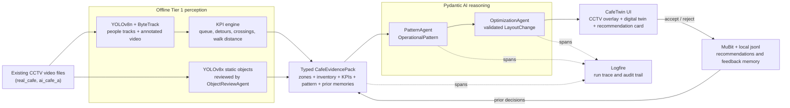

# Architecture Notes

This folder holds short implementation notes that translate the plans into
buildable boundaries.

- `mvp_spine.md` defines the real backend path we build first.
- `project_structure.md` explains what each folder owns.
- `fixture_contract.md` summarizes the demo-data files the MVP expects.
- `vision_orchestrator_connection.md` describes the vision ↔ agent handshake — the typed contract Tier 1 perception hands the agent (relevant once live YOLO + KPI engine come online).

## Tier 1 architecture

This Mermaid diagram is the source-of-truth architecture visual for docs and the
README. It replaces the generated architecture PNG/HTML artifact.

