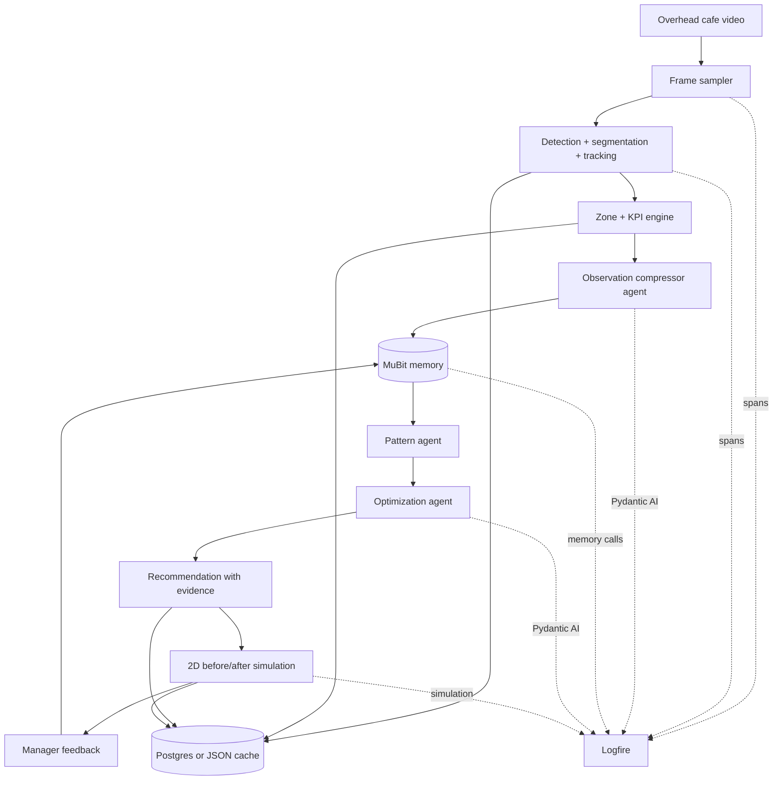
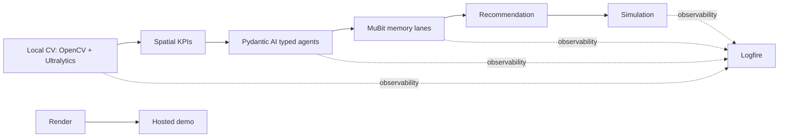
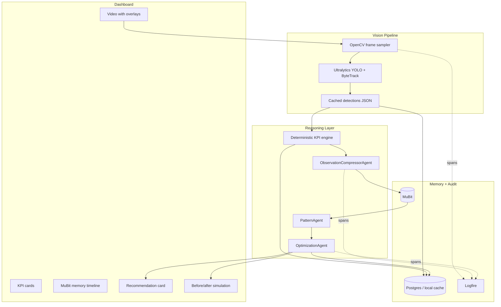
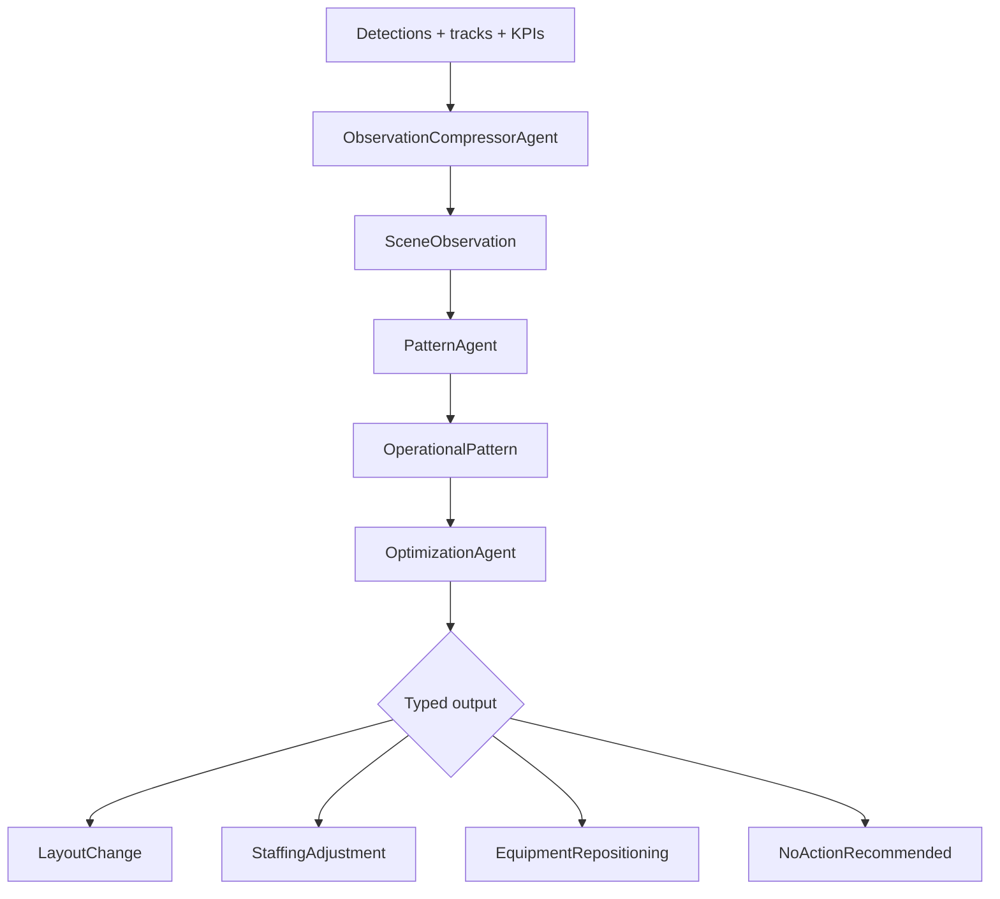

# CafeTwin: Overview Plan

## One-Line Pitch

CafeTwin turns overhead cafe video into spatial operations intelligence: it detects movement, remembers repeated bottlenecks, and recommends layout changes with evidence and predicted KPI impact.

> POS tells you what sold. CafeTwin shows why throughput stalled.

## What We Are Building

For the hackathon, build a polished demo that analyzes one overhead cafe video and produces one credible recommendation:

> Move table cluster B 0.8m left to reduce staff/customer crossings, lower queue obstruction, and shorten staff walking paths.

The proof is not "AI says so." The proof is an evidence chain:

```text
video frame -> detections/tracks -> zones/KPIs -> MuBit memories
-> Pydantic AI recommendation -> before/after simulation -> Logfire trace
```

## Core Demo Loop



## Recommended Local Vision Stack

Use local computer vision first. For this project, Ultralytics + OpenCV is doable and gives the demo a stronger "we built the pipeline" story than calling a hosted vision workflow. Cache outputs so the live demo is reliable.

| Need | Default | Fallback | Why |
|---|---|---|---|
| Frame sampling | OpenCV `cv2.VideoCapture` | Pre-extracted frames | Simple, controllable, works offline. |
| Detection | Ultralytics YOLO local model | Cached detections JSON | Person/table/chair boxes are enough for the main KPIs. |
| Tracking | Ultralytics `model.track(..., tracker="bytetrack.yaml")` | Simple centroid tracker | Needed for trails, dwell, path crossings. |
| Segmentation | YOLO segmentation model, only for furniture masks | Bounding boxes only | Stretch for table/chair footprint and after-image polish. |
| Zones | Hardcoded/manual polygons in app | `zones.json` edited by hand | Fastest way to make spatial claims credible. |
| KPIs | Custom deterministic Python + OpenCV geometry | Cached KPI JSON | KPI math should be explainable and reproducible. |
| Memory | MuBit SDK | Local JSON fallback | MuBit stores compressed operational observations. |
| Agents | Pydantic AI | Cached proposal fallback | Typed outputs make the recommendation trustworthy. |
| Simulation | Deterministic 2D map | Pre-rendered fallback image | This is the proof mechanism. |
| Inpainted after image | Replicate / local diffusion if already configured | Skip | Stretch polish, not core proof. |

## Sponsor Stack Fit



- **Pydantic AI:** typed `SceneObservation`, `OperationalPattern`, and `LayoutChange` outputs.
- **Logfire:** one trace from video analysis to recommendation and simulation.
- **MuBit:** operational memory across video windows and feedback.
- **Render:** hosted demo.

## MVP Scope

Build only the path needed for a convincing 3-minute demo:

1. Load a seeded overhead cafe video.
2. Show detections, masks/tracks, zones, trails, and heatmap.
3. Compute spatial KPIs.
4. Compress KPI windows into MuBit memories.
5. Use Pydantic AI to generate one typed layout recommendation.
6. Show before/after 2D simulation with KPI deltas.
7. Record feedback back into memory.
8. Show Logfire trace.

Cut from MVP:

- Live camera feed.
- POS integration.
- Full restaurant table-service complexity.
- True predictive world model.
- Generated video as a required feature.
- Custom model training.
- Real staff/customer identity.

## Product Architecture



## MuBit Memory Lanes

| Lane | Contents |
|---|---|
| `location:demo:scene` | Compressed 10-second scene observations. |
| `location:demo:kpi` | Queue, walking, crossing, dwell, heatmap summaries. |
| `location:demo:patterns` | Repeated bottlenecks with evidence IDs. |
| `location:demo:recommendations` | Accepted/rejected recommendations and feedback. |
| `org:rules` | Hard constraints like minimum walkway width. |

MuBit should not store every raw frame or every raw bounding box. Store raw detections in Postgres/local JSON; store compressed operational memory in MuBit.

## Pydantic AI Agents



The main hackathon output should be `LayoutChange`.

Every recommendation must include:

- title
- rationale
- evidence IDs
- expected KPI deltas
- confidence
- risk
- simulation spec

## KPIs To Show

Use metrics judges can understand instantly:

- Staff walking distance.
- Staff/customer path crossings.
- Queue length proxy.
- Queue obstruction time.
- Congestion heatmap.
- Table cluster detour score.

Avoid "coffees served per staff member" in the MVP unless the video makes service events visually obvious. Use "service interactions completed" as a proxy instead.

## 24h Build Plan

| Time | Goal | Output |
|---|---|---|
| 0-4h | Visual proof | Video, zones, cached detections, trails. |
| 4-8h | KPI engine | Crossings, walking distance, queue proxy, heatmap. |
| 8-12h | Memory | MuBit observation writes and visible memory timeline. |
| 12-16h | Recommendation | Pydantic AI emits one typed `LayoutChange`. |
| 16-20h | Simulation | 2D before/after map and recomputed KPI deltas. |
| 20-24h | Polish | Logfire trace, Render deploy, fallback recording, pitch. |

## Demo Script

1. "Restaurants optimize from POS, but POS is blind to physics."
2. Show overhead video with tracks, zones, and heatmap.
3. Show KPI cards: crossings, walking distance, queue obstruction.
4. Show MuBit memory timeline.
5. Generate recommendation: "Move table cluster B 0.8m left."
6. Show evidence chain and expected deltas.
7. Click simulate and show before/after map.
8. Open Logfire trace: video -> KPI -> memory -> agent -> simulation.

## Why This Can Win

- **Build quality:** real visual pipeline plus typed agent output.
- **Insight:** spatial bottlenecks are invisible to POS analytics.
- **Viability:** cafes, QSR operators, franchisees, layout consultants, and ghost kitchens have clear ROI.
- **Execution:** the demo is visual, auditable, and sponsor tools are in the core path.

## References

- Ultralytics tracking mode: https://docs.ultralytics.com/modes/track/
- Ultralytics Python usage: https://docs.ultralytics.com/usage/python/
- OpenCV video I/O: https://docs.opencv.org/4.x/dd/d43/tutorial_py_video_display.html
