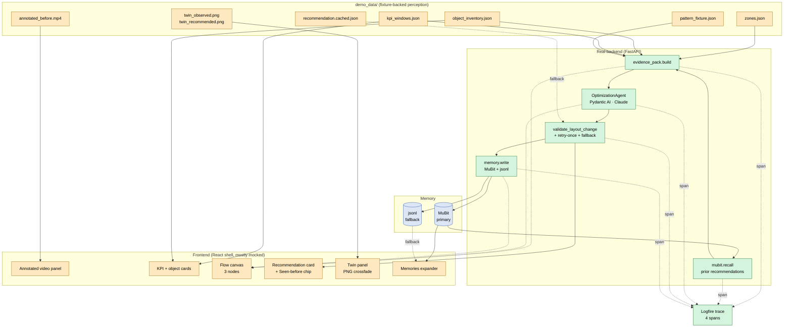

# CafeTwin / SimCafe — Overview Plan

## One-Line Pitch

CafeTwin turns overhead cafe video into spatial operations intelligence: it surfaces repeated bottlenecks and recommends layout changes with evidence and predicted KPI impact.

> POS tells you what sold. CafeTwin shows why throughput stalled.

## Build Philosophy (locked)

```
MVP    = real intelligence (typed Pydantic AI agent + traced reasoning + memory),
         mocked spectacle (prebaked twin images, fixture-backed perception)
Tier 1 = realer perception (live KPI engine + offline YOLO + PatternAgent or typed pattern builder)
Tier 2 = richer spectacle (R3F twin, chat, scenario rail, hero asset)
```

Time remaining: **~18h**. Two- or three-person team. MVP must ship by hour 14 with 4h reserved for polish, deploy, and pitch rehearsal. Tier 1 and Tier 2 only land if MVP is green and stable.

If only MVP ships, the project is still defensible: real typed agent, real evidence chain, real memory write, real Logfire trace, real before/after delta. Spectacle is honestly framed as "operations console," not "tycoon game."

## Visual Architecture (MVP)



Legend: green = real live code in MVP. amber = fixture-backed or mocked. blue = data store.

## What MVP Must Ship

A single linear demo flow with four clicks: **Load demo → Generate recommendation → Apply → Accept / Reject**.

### Demo artifacts (fixture-backed)

```
demo_data/
  source_video.mp4                # original overhead clip (seeded)
  annotated_before.mp4            # pre-rendered overlay video (boxes/tracks/zones)
  tracks.cached.json              # YOLO+ByteTrack output, generated offline (or hand-authored)
  zones.json                      # hand-drawn polygons (queue/pickup/seating/staff_path/counter)
  object_inventory.json           # chair/table/counter/pickup_shelf counts + xy
  kpi_windows.json                # KPI engine output (precomputed for MVP, live in Tier 1)
  pattern_fixture.json            # one OperationalPattern with evidence IDs
  recommendation.cached.json      # deterministic LayoutChange fallback (used if agent retry fails)
  twin_observed.png               # prebaked baseline twin (used by MVP)
  twin_recommended.png            # prebaked recommended twin (used by MVP)
  twin_observed.json              # structured twin layout (used by Tier 2 R3F)
  twin_recommended.json           # structured twin layout (used by Tier 2 R3F)
  mubit_fallback.jsonl            # local-first memory lane, created at runtime
```

### Real backend workflow (MVP)

```
load fixtures
  → MuBit recall (prior recommendations for this pattern)
  → build CafeEvidencePack (typed Pydantic input bundle, includes prior_recommendations)
  → OptimizationAgent (Pydantic AI, live)
  → typed LayoutChange (Pydantic-validated, evidence_ids must reference pattern fixture)
  → memory write (MuBit primary + jsonl fallback always)
  → return to UI
```

One Logfire trace with these spans:

1. `evidence_pack.build` → child: `mubit.recall`
2. `optimization_agent.run`
3. `layout_change.validate`
4. `memory.write` → children: `memory.write.mubit`, `memory.write.jsonl`

Single live Pydantic AI agent. (Optional add: a tiny `EvidenceSummarizerAgent` to satisfy "agentic workflow" plural — see agent_plan.md §Optional second agent.)

### UI (rich shell, mostly mocked)

Keep the panel layout from `docs/superpowers/specs/2026-04-25-simcafe-ui-design.md`, but render the following as cheap mocks:

| Surface | MVP behavior |
|---|---|
| Top bar | Real Logfire trace link |
| Observed video panel | Plays `annotated_before.mp4`. Optional: collapsible "raw data" expander showing `tracks.cached.json`. |
| Object count + KPI cards | Real numbers from `kpi_windows.json` (precomputed), agent's predicted deltas after Apply |
| Agent flow canvas | 3 nodes (`evidence_pack`, `optimization_agent`, `memory_write`), wired to real backend stage events (cheap SSE or stage timestamps replayed client-side) |
| Recommendation card | Renders the real `LayoutChange` returned by `/api/run` |
| 3D twin panel | **Prebaked PNG crossfade** between `twin_observed.png` and `twin_recommended.png`. No R3F, no geometry code. |
| Memories panel | Collapsible expander reading `GET /api/memories` (MuBit primary, jsonl fallback). Each row shows the `mubit_id` chip when present. |
| Scenario rail | Cut from MVP. Single observed ⇄ recommended toggle inside the twin panel. |
| Chat panel | Cut from MVP. Replaced by a "Generate recommendation" button + the recommendation card. |

### Interaction (4 clicks)

1. **Load demo** — annotated video plays, KPI/object count cards populate from cached JSON, baseline twin image shows.
2. **Generate recommendation** — flow canvas lights through 3 stages, recommendation card renders with rationale, evidence IDs (cited from pattern fixture), expected KPI deltas, confidence, risk.
3. **Apply** — twin crossfades to `twin_recommended.png`, KPI delta cards animate in (numbers from `LayoutChange.expected_kpi_delta`).
4. **Accept / Reject** — writes feedback memory (local jsonl + MuBit best-effort), toast confirms, "Memories" expander updates.

Then click the Logfire link in the top bar to show the real trace.

## Tier 1 — Realer Perception (only if MVP is green)

Upgrade the upstream layer; UI mostly unchanged.

- Run YOLO + ByteTrack offline (or on demand) on the seeded video to produce real `tracks.cached.json` + `annotated_before.mp4` (replaces hand-authored fixtures).
- Run the deterministic KPI engine live on cached tracks + zones (replaces precomputed `kpi_windows.json`).
- Add a second live agent — either a real `PatternAgent` or a deterministic pattern builder — so the chain is `KPI engine → PatternAgent → OptimizationAgent`.
- Add 3 more memory writes: KPI summary, object inventory, pattern.
- Logfire trace grows to 6–7 spans.

No UI changes required. The demo looks identical; the pitch becomes "the perception layer is also real."

## Tier 2 — Richer Spectacle (only if Tier 1 is green)

Upgrade the UI; backend mostly unchanged.

- Replace prebaked twin images with R3F isometric scene rendering `twin_observed.json` / `twin_recommended.json`. Box prefabs only — no Hyper3D, no postprocessing.
- Add scenario rail with 2–3 prebaked concept scenarios (e.g. "Brooklyn-style"). Switching swaps prebaked layouts.
- Add chat panel with **supported prompts only** (regex/keyword routing): "reduce crossings," "show Brooklyn concept," "compare baseline and recommendation." Anything else returns a canned reply.
- Wire flow-node animation to real backend stage events for every span.
- Richer memory timeline UI with hover previews and lane labels.
- Optional: Hyper3D / prebaked GLB hero asset (single object).
- Optional: live YOLO upload path.

## Non-Goals (will not be built in 18h)

- Live camera feed.
- POS integration.
- Photorealistic 3D reconstruction.
- Drag-and-drop on the twin.
- Scenario forking / archiving / N-way compare.
- Multimodal chat (image paste, voice).
- Custom model training.
- Real staff/customer identity tracking.
- Whole-scene generative 3D.

## Stack

| Concern | Choice |
|---|---|
| Backend | FastAPI + Pydantic AI (Anthropic Claude Sonnet 4.x) + Logfire |
| Memory | local jsonl (source of truth) + MuBit (best-effort, fire-and-forget) |
| Vision (offline only in MVP) | Ultralytics YOLO + ByteTrack + OpenCV + ffmpeg |
| KPI engine | Deterministic Python (numpy + shapely or `cv2.pointPolygonTest`) |
| Frontend | Vite + React 18 + TypeScript + Tailwind + shadcn/ui |
| KPI/object cards | Tremor |
| Flow canvas | `@xyflow/react` (3 static nodes in MVP) |
| Twin panel (MVP) | `` crossfade between two PNGs |
| Twin panel (Tier 2) | `@react-three/fiber` + `drei` |
| Chat (Tier 2 only) | Vercel AI SDK |
| Hosting | Render (backend) + static frontend |

## Sponsor-tool fit

- **Pydantic AI:** typed `OptimizationAgent` emitting validated `LayoutChange`. Optional `EvidenceSummarizerAgent`.
- **Logfire:** single trace covering evidence pack → agent run → validation → memory write.
- **MuBit:** primary memory store. MVP uses both `remember` (recommendations + feedback) and `recall` (prior recommendations on the same pattern, surfaced in the recommendation card as a "Seen before" chip). Tier 1 adds KPI/inventory/pattern lanes. Local jsonl is a hot fallback always written in parallel per AGENTS.md.
- **Render:** hosted demo URL.

## 18h Build Plan (2-person split: A=backend, B=frontend)

| Hours | Track A — backend | Track B — frontend |
|---|---|---|
| 0–3 | Hand-author or extract `tracks.cached.json`, `zones.json`, `object_inventory.json`, `kpi_windows.json`, `pattern_fixture.json`, `recommendation.cached.json`. Generate `annotated_before.mp4` (ffmpeg + cached overlays, or hand-rendered). Render `twin_observed.png` + `twin_recommended.png` (matplotlib isometric or Figma). | Vite+React+Tailwind shell, panel grid, top bar with Logfire-link slot, empty/loading states, video player wired to `annotated_before.mp4`. |
| 3–7 | Pydantic schemas (`KPIReport`, `ObjectInventory`, `OperationalPattern`, `LayoutChange`, `SimulationSpec`, `CafeEvidencePack`). `OptimizationAgent` live with strict prompt requiring `evidence_ids` ⊆ pattern fixture IDs. Post-validation + retry-once + fallback to `recommendation.cached.json`. | KPI/object count cards (Tremor) reading static JSON. Recommendation card component. 3-node flow canvas (static). Twin panel with crossfade between two PNGs + observed/recommended toggle. |
| 7–11 | FastAPI endpoints (`/api/run`, `/api/feedback`, `/api/state`, `/api/logfire_url`). Stage events (SSE or stage-timestamps). Logfire spans. MuBit writer + jsonl fallback. | Wire "Generate recommendation" button → `/api/run`, render returned stage events in flow canvas, render returned `LayoutChange` in card. Apply button → toggle twin + show KPI deltas from `expected_kpi_delta`. |
| 11–14 | End-to-end smoke. Prompt-tune until agent reliably cites real evidence IDs. Feedback endpoint writes to jsonl + MuBit. | Accept/Reject buttons → POST feedback. Memories expander reading jsonl. Logfire link wired in top bar. Loading/error toasts. |
| 14–16 | Render deploy backend, env wiring, fallback recording of full flow as a video. | Polish: animations, copy, empty states, demo seeding. Fallback recording. |
| 16–18 | Pitch rehearsal. **Cut anything still risky.** Final push. | Same. |

If MVP is green by hour 12, A starts Tier 1 (live KPI engine on cached tracks → live `pattern_builder` or `PatternAgent`); B starts Tier 2 prep (R3F box scaffold, scenario chips). Don't merge Tier 1/2 work into the demo branch unless it's stable and green by hour 16.

## Demo Script (90 seconds)

1. *"POS tells operators what sold. CafeTwin shows why throughput stalled. Watch."* — annotated video plays.
2. *"Real KPIs from the overhead video: 18 staff/customer crossings in this minute, queue obstructed for 41 seconds, table detour score 1.6."* — KPI cards.
3. **Click Generate recommendation.** *"A typed Pydantic AI agent reads the evidence pack and emits a validated `LayoutChange`."* — flow canvas lights, card renders.
4. *"It cites real evidence IDs from the operational pattern, with expected KPI deltas and a confidence."* — read the card.
5. **Click Apply.** *"Here's the before/after preview, with the agent's predicted deltas."* — twin crossfades, deltas animate.
6. **Click Accept.** *"Feedback writes to MuBit; jsonl mirrors it as a hot fallback."* — memories expander updates with a fresh `mubit_id` chip.
7. **Click Generate again.** *"This time the agent recalls the prior recommendation from MuBit — see the 'Seen before' chip."* — operational memory loop visible.
8. **Click Logfire.** *"Single trace from MuBit recall to MuBit + jsonl write."* — open in new tab.
9. *"The perception layer is fixture-backed for demo reliability. The reasoning, typed output, validation, memory recall + write, and trace are real."*

## Why This Wins The Room

- **Real intelligence:** typed agent + Pydantic validation + evidence chain + memory + Logfire trace are all genuinely live and observable.
- **Honest framing:** we explicitly say what's fixture-backed vs live. No fake-AI demo theater.
- **Sponsor-tool depth:** Pydantic AI is the spine, MuBit is the memory, Logfire is the audit trail, Render hosts it. Every sponsor tool is on the critical demo path.
- **Graceful degradation:** if Tier 1 doesn't land, MVP still ships. If Tier 2 doesn't land, MVP still ships. Failure modes are designed in.

## References

- Pydantic AI docs: https://pydantic.dev/docs/ai/overview/
- MuBit docs: https://docs.mubit.ai/
- Ultralytics tracking (Tier 1): https://docs.ultralytics.com/modes/track/
